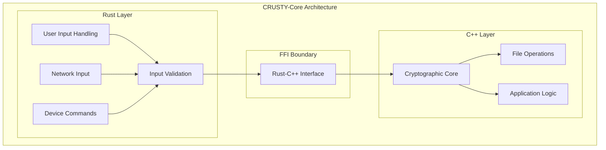
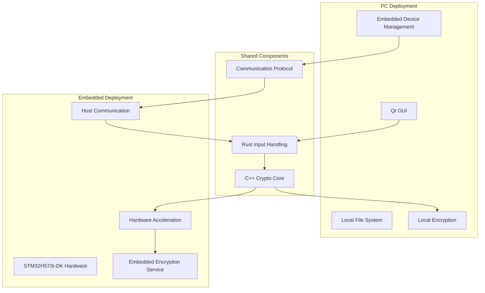
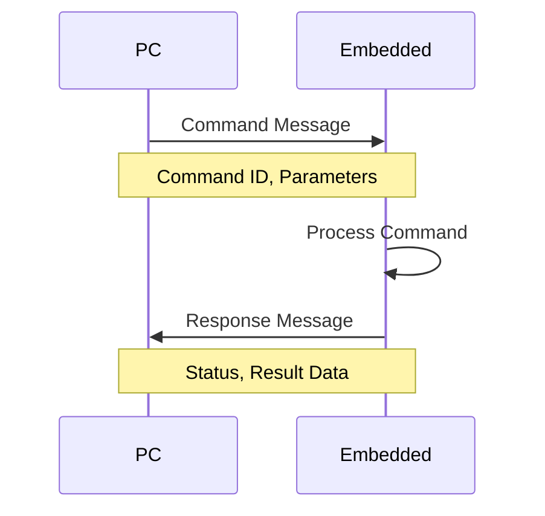
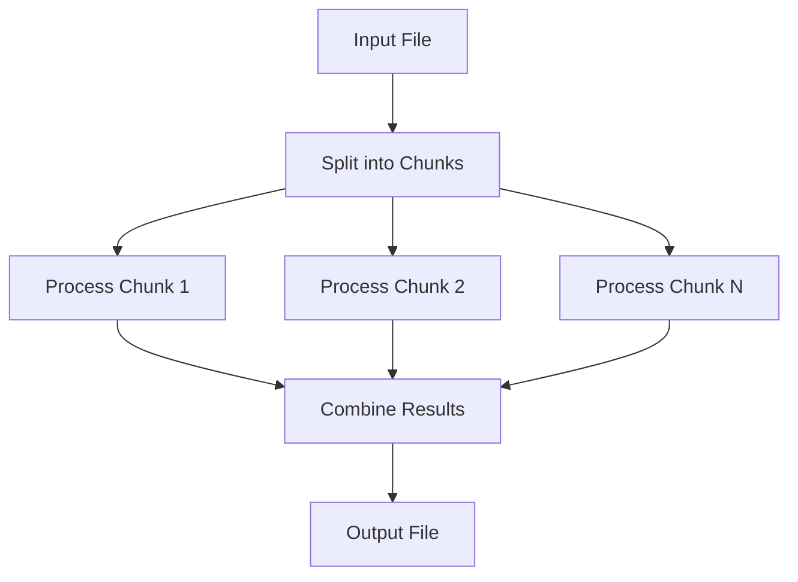
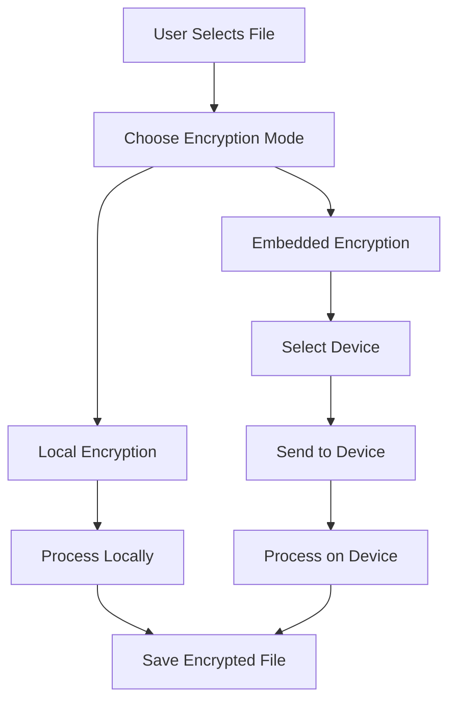

# CRUSTY-Core System Design Document

**Author: Shawn Ahern**  
**Date: March 4, 2025**

## 1. Introduction

This document describes the system design for CRUSTY-Core, a secure file encryption application with dual functionality: a PC application with Qt UI and an embedded deployment on STM32H573I-DK hardware. The architecture leverages Rust for all input handling while maintaining the cryptographic core in C++, combining the memory safety benefits of Rust with the performance and compatibility of C++.

## 2. Architectural Overview

### 2.1 Design Philosophy

The CRUSTY-Core architecture is built on two key principles:

1. **Rust for Input Handling**: All functions that take input from users or other devices (network, input fields, etc.) are implemented in Rust to leverage its memory safety and security features.

2. **C++ for Cryptographic Core**: The core cryptographic operations are implemented in C++ for performance and compatibility with existing libraries and hardware acceleration.

### 2.2 High-Level Architecture



### 2.3 Dual Functionality

CRUSTY-Core supports two deployment targets:



## 3. Component Details

### 3.1 Rust Input Handling Layer

The Rust layer is responsible for processing all inputs from users, networks, and devices. This includes:

- GUI input validation
- Command parsing and validation
- Network protocol handling
- File data validation
- Error handling and reporting

**Example: Input Validation in Rust**

```rust
pub fn validate_user_input(input: &str) -> Result<ValidatedInput, ValidationError> {
    // Check for empty input
    if input.is_empty() {
        return Err(ValidationError::EmptyInput);
    }
    
    // Check for maximum length
    if input.len() > MAX_INPUT_LENGTH {
        return Err(ValidationError::InputTooLong);
    }
    
    // Validate content
    if !input.chars().all(|c| c.is_alphanumeric() || c == '_') {
        return Err(ValidationError::InvalidCharacters);
    }
    
    Ok(ValidatedInput::new(input))
}
```

### 3.2 C++ Cryptographic Core

The C++ layer implements the core cryptographic operations, including:

- AES-256-GCM encryption and decryption
- Key derivation using Argon2
- Key management
- File operations
- Hardware acceleration interface (for embedded target)

**Example: C++ Encryption Function**

```cpp
bool Encryptor::encryptData(const uint8_t* data, size_t dataLen, 
                           const uint8_t* key, size_t keyLen,
                           uint8_t* output, size_t* outputLen) {
    // Initialize encryption context
    AES_GCM_Context ctx;
    if (!initContext(&ctx, key, keyLen)) {
        return false;
    }
    
    // Process data
    return processData(&ctx, data, dataLen, output, outputLen);
}
```

### 3.3 FFI Boundary

The FFI (Foreign Function Interface) boundary defines how Rust and C++ components communicate. It includes:

- Type-safe function signatures
- Memory ownership transfer rules
- Error propagation mechanisms
- Data validation at the boundary

**Example: FFI Interface Definition**

```rust
// Rust side of FFI
#[no_mangle]
pub extern "C" fn validate_and_encrypt(
    input_ptr: *const c_char,
    input_len: usize,
    key_ptr: *const c_char,
    key_len: usize,
    output_ptr: *mut u8,
    output_len: *mut usize
) -> c_int {
    // Convert C inputs to Rust
    let input = unsafe { slice::from_raw_parts(input_ptr as *const u8, input_len) };
    let key = unsafe { slice::from_raw_parts(key_ptr as *const u8, key_len) };
    
    // Validate input
    if let Err(_) = validate_input(input) {
        return ERROR_INVALID_INPUT;
    }
    
    // Call C++ encryption function
    unsafe {
        cpp_encrypt_data(input.as_ptr(), input.len(), 
                        key.as_ptr(), key.len(),
                        output_ptr, output_len)
    }
}
```

## 4. PC Deployment

### 4.1 Qt User Interface

The PC deployment includes a Qt-based user interface that provides:

- File selection for encryption/decryption
- Password input and 2FA
- Progress reporting
- Embedded device management

All user inputs from the Qt UI are passed to the Rust layer for validation before being processed.

### 4.2 Local Encryption

The PC deployment supports local encryption using the C++ cryptographic core. This provides:

- File encryption/decryption on the local file system
- Password-based key derivation
- Progress reporting and error handling

### 4.3 Embedded Device Management

The PC application includes features for managing connected embedded devices:

- Device detection and connection
- Firmware installation and configuration
- Encryption service requests
- Key management

**Example: Embedded Device Detection**

```cpp
std::vector<DeviceInfo> EmbeddedDeviceManager::detectDevices() {
    std::vector<DeviceInfo> devices;
    
    // Scan for USB devices
    auto usbDevices = scanUsbDevices();
    for (const auto& dev : usbDevices) {
        if (isStm32h5Device(dev)) {
            devices.push_back(createDeviceInfo(dev));
        }
    }
    
    return devices;
}
```

## 5. Embedded Deployment

### 5.1 STM32H573I-DK Hardware

The embedded deployment runs on STM32H573I-DK hardware, which provides:

- ARM Cortex-M7 processor
- Hardware cryptographic accelerators
- Secure storage
- Communication interfaces (USB, UART)

### 5.2 Hardware Acceleration

The embedded deployment leverages the STM32H5's hardware cryptographic accelerators for improved performance:

- AES-GCM hardware acceleration
- SHA hardware acceleration
- True random number generation

**Example: Hardware Acceleration Interface**

```cpp
bool initHardwareAccelerator(EncryptionContext* context) {
    // Configure AES-GCM hardware
    HAL_CRYP_Init(&context->hcryp);
    
    // Set key
    if (HAL_CRYP_SetKey(&context->hcryp, context->key, context->keyLen) != HAL_OK) {
        return false;
    }
    
    // Set IV
    return HAL_CRYP_SetInitVector(&context->hcryp, context->iv, 12) == HAL_OK;
}
```

### 5.3 Host Communication

The embedded deployment communicates with the host PC through a secure protocol implemented in Rust:

- Command reception and parsing
- Response formatting
- Error handling
- Flow control

### 5.4 Embedded Encryption Service

The embedded device provides encryption services to the connected host:

- File encryption/decryption
- Key management
- Secure operations

## 6. Communication Protocol

### 6.1 Protocol Overview

The communication protocol between PC and embedded device is implemented in Rust and follows a command-response pattern:



### 6.2 Message Format

Messages follow a binary format with headers, payloads, and checksums:

```
Command Message:
[2 bytes: Magic] [1 byte: Type] [4 bytes: Length] [4 bytes: Command ID] [Variable: Payload] [2 bytes: CRC]

Response Message:
[2 bytes: Magic] [1 byte: Type] [4 bytes: Length] [4 bytes: Command ID] [1 byte: Status] [Variable: Payload] [2 bytes: CRC]
```

### 6.3 Command Processing

Commands are processed through a pipeline that ensures security at each step:


## 7. Build System

### 7.1 Unified Build System

The build system supports both PC and embedded targets from a single codebase:

- CMake as the primary build orchestrator
- Corrosion for Rust integration
- Conditional compilation for target-specific code

**Example: CMake Configuration for Dual Targets**

```cmake
# Common components
add_library(cpp_crypto_core
    src/cpp/crypto/encryptor.cpp
    src/cpp/crypto/key_management.cpp
)

# Conditional compilation for PC target
if(BUILD_PC_TARGET)
    add_executable(crusty_qt src/cpp/main.cpp)
    target_link_libraries(crusty_qt PRIVATE 
        cpp_crypto_core
        qt_ui
        rust_input_pc
    )
endif()

# Conditional compilation for embedded target
if(BUILD_EMBEDDED_TARGET)
    add_executable(crusty_embedded src/cpp/embedded_main.cpp)
    target_link_libraries(crusty_embedded PRIVATE 
        cpp_crypto_core
        rust_input_embedded
    )
endif()
```

### 7.2 Rust Conditional Compilation

Rust code uses feature flags for conditional compilation:

**Example: Rust Conditional Compilation**

```rust
#[cfg(feature = "std")]
pub fn pc_specific_function() {
    // PC-specific implementation using std library
    std::fs::File::open("config.txt").unwrap();
}

#[cfg(not(feature = "std"))]
pub fn embedded_specific_function() {
    // Embedded-specific implementation without std
    // Uses no_std compatible alternatives
}
```

## 8. Security Considerations

### 8.1 Memory Safety

Rust's ownership model ensures memory safety for all input handling:

- No buffer overflows
- No use-after-free vulnerabilities
- No data races
- Explicit error handling

### 8.2 Input Validation

All inputs are validated in Rust before processing:

- Type checking
- Range validation
- Format validation
- Sanitization

### 8.3 Secure Communication

Communication between PC and embedded device is secured:

- Message authentication
- Encryption for sensitive data
- Protection against replay attacks
- Error detection

### 8.4 Hardware Security

The STM32H5 provides hardware security features:

- Secure boot
- Secure storage
- Hardware isolation
- Side-channel attack countermeasures

## 9. Performance Considerations

### 9.1 Chunked Processing

Large files are processed in chunks to manage memory usage:



### 9.2 Hardware Acceleration

The embedded target leverages hardware acceleration for improved performance:

- AES-GCM hardware accelerator for encryption/decryption
- SHA hardware accelerator for hashing
- DMA for efficient data transfer

### 9.3 Parallel Processing

The PC target uses parallel processing for large files:

- Multiple threads for chunk processing
- Progress reporting across threads
- Synchronization for result combination

## 10. User Experience

### 10.1 PC Application

The PC application provides a seamless user experience:

- Intuitive file selection and operation
- Clear progress reporting
- Embedded device management
- Error reporting and recovery

### 10.2 Encryption Modes

Users can choose between local and embedded encryption:



### 10.3 Embedded Installation

The PC application provides a simple interface for installing CRUSTY-Core on embedded devices:

- Device detection
- Firmware installation
- Configuration
- Verification

## 11. Conclusion

The CRUSTY-Core system design leverages the strengths of both Rust and C++ to create a secure, high-performance file encryption application with dual functionality. By using Rust for all input handling and C++ for the cryptographic core, the system achieves both memory safety and performance.

The dual-target architecture supports both PC and embedded deployments, providing flexibility and enhanced security options. The ability to offload encryption to a dedicated STM32H5 device provides additional security benefits for sensitive operations, while the local encryption option ensures convenience for everyday use.
