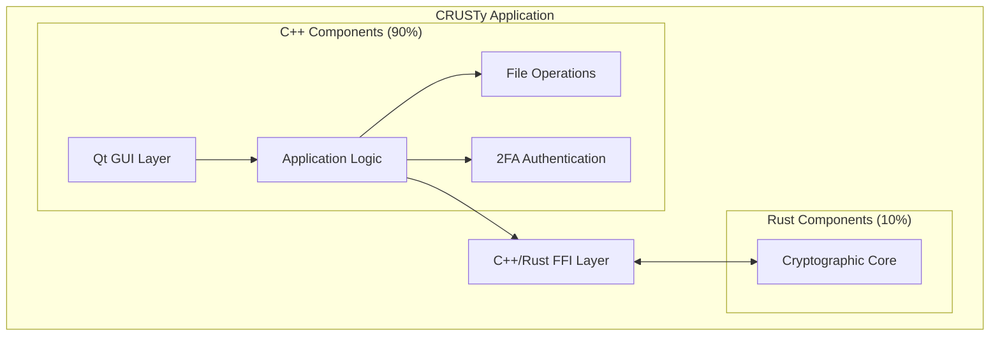
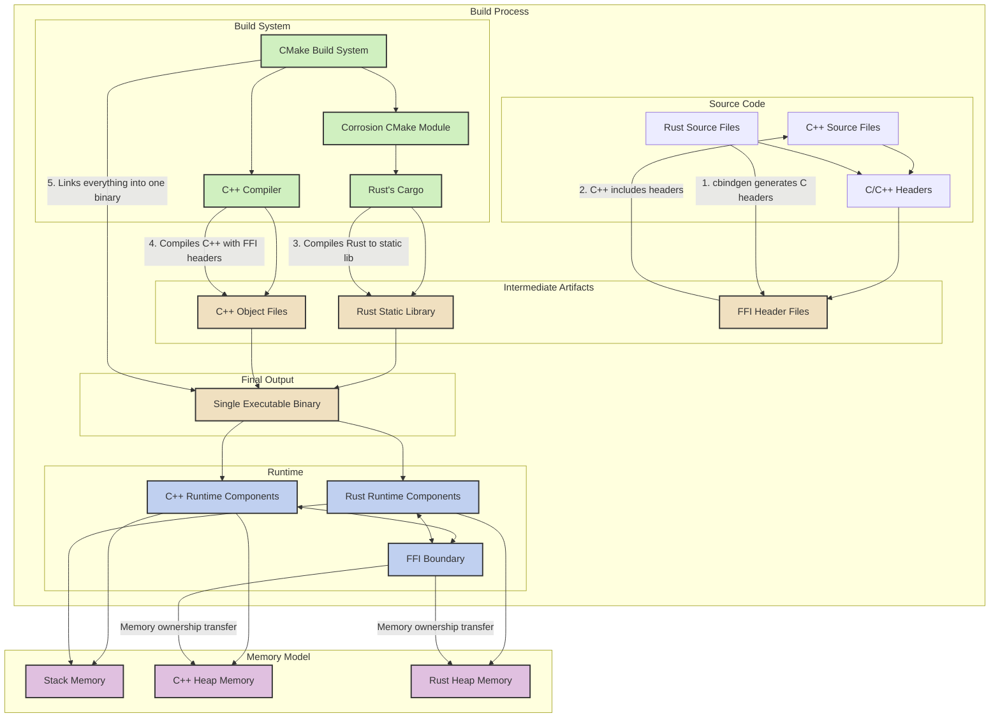

# CRUSTy Development Plan

**Author: Shawn Ahern**  
**Date: March 4, 2025**

## Executive Summary

This document outlines the development plan for CRUSTy, a hybrid C++/Rust implementation of the file encryption application. This version (maintained in the CRUSTy-Core repository) will maintain the core security features of the original CRUSTy while implementing a modern Qt-based user interface and adding two-factor authentication for enhanced security. The initial version will focus on single file encryption with password-based 2FA for decryption.

The development approach leverages a hybrid architecture that combines C++ for the user interface and application logic (90%) with Rust for security-critical cryptographic operations (10%). This approach balances developer familiarity and enterprise compatibility with the memory safety benefits of Rust for security-sensitive code.

## Architectural Overview

CRUSTy will follow a layered architecture that separates the user interface, application logic, and cryptographic core:

### Key Components

1. **Qt GUI Layer**: A modern, cross-platform user interface built with Qt 6, providing intuitive file selection, encryption/decryption workflows, and 2FA input.

2. **Application Logic**: Core business logic implemented in C++, managing the overall application flow, state, and coordinating between UI and cryptographic operations.

3. **File Operations**: Handles file reading, writing, and metadata management, implemented in C++ for compatibility with enterprise systems.

4. **2FA Authentication**: Implements Time-based One-Time Password (TOTP) verification as a second authentication factor for enhanced security.

5. **Cryptographic Core**: Security-critical encryption and decryption operations implemented in Rust, leveraging its memory safety guarantees for maximum security.

6. **FFI Layer**: A carefully designed Foreign Function Interface that enables secure and efficient communication between C++ and Rust components.

## Development Phases

### Phase 1: Project Setup and Core Architecture

**Objectives:**
- Fork the CRUSTy repository and establish the new project structure
- Define the interface between C++ and Rust components
- Extract and adapt the core encryption functionality from CRUSTy
- Set up the basic Qt application framework

**Key Deliverables:**
- Project repository with initial structure and build system
- Interface definitions for cross-language communication
- Core cryptographic functions adapted for the new architecture
- Basic Qt application shell with placeholder UI

**Technical Approach:**
The FFI boundary will be carefully designed to ensure type safety and memory safety across language boundaries. The interface will include functions for data encryption/decryption, password hashing, and key derivation. A C++ wrapper class will provide a clean, object-oriented interface to the Rust cryptographic functions.

### Phase 2: Core Functionality Implementation

**Objectives:**
- Implement the Rust cryptographic functions for encryption and decryption
- Create C++ wrappers and file operation handlers
- Develop the basic Qt user interface
- Implement progress tracking and error handling

**Key Deliverables:**
- Functional encryption and decryption operations
- File handling with proper error management
- Basic user interface for file selection and operation control
- Progress reporting and user feedback mechanisms

**Technical Approach:**
The cryptographic implementation will port the AES-256-GCM encryption from CRUSTy, adding password-based key derivation using Argon2 for enhanced security. The C++ layer will handle file operations and provide a clean interface to the Qt UI components. The user interface will include file selection dialogs and basic progress reporting.

### Phase 3: 2FA and Enhanced Security

**Objectives:**
- Implement two-factor authentication for decryption
- Add TOTP (Time-based One-Time Password) support
- Enhance security features and error handling
- Improve user feedback mechanisms

**Key Deliverables:**
- Complete 2FA implementation with TOTP support
- Secure password storage and memory handling
- Enhanced error messages and input validation
- Improved progress reporting and user feedback

**Technical Approach:**
The 2FA implementation will use industry-standard TOTP algorithms, compatible with authenticator apps like Google Authenticator or Authy. The UI will provide a clean interface for entering both the password and the second factor. Security enhancements will include secure memory handling and comprehensive input validation.

### Phase 4: Polish and Optimization

**Objectives:**
- Improve the user interface with theming and usability enhancements
- Optimize performance for large files
- Conduct comprehensive testing
- Create user and developer documentation

**Key Deliverables:**
- Polished user interface with theming support
- Optimized file handling for large files
- Comprehensive test suite
- Complete user and developer documentation

**Technical Approach:**
Performance optimization will include file chunking for large files and parallel processing where appropriate. The UI will be enhanced with theming support and improved layouts. A comprehensive testing strategy will ensure both the C++ and Rust components function correctly and securely.

## Technical Highlights

### Cross-Language Integration

The integration between C++ and Rust will be handled through a carefully designed Foreign Function Interface (FFI). This interface will:

- Define clear boundaries between language domains
- Ensure type safety across language boundaries
- Handle memory management safely between languages
- Provide error propagation mechanisms
- Support complex data structures through serialization

### Two-Factor Authentication

The 2FA implementation will enhance security by requiring:

1. Something the user knows (password)
2. Something the user has (TOTP code from an authenticator app)

This significantly increases security by ensuring that even if a password is compromised, the encrypted files remain protected.

## FFI, CMake, and Corrosion Integration

The following diagram illustrates in detail how FFI, CMake, and Corrosion work together to integrate C++ and Rust code into a single binary:

### Key Integration Components

1. **FFI (Foreign Function Interface)**:
   - Defines the boundary between C++ and Rust code
   - Specifies function signatures that are compatible across languages
   - Handles type conversions between Rust and C++ types
   - Manages memory ownership transfer between language runtimes
   - Provides error propagation mechanisms

2. **CMake Build System**:
   - Serves as the primary build orchestrator
   - Configures the build environment for both C++ and Rust
   - Manages dependencies and build order
   - Handles platform-specific build settings
   - Invokes the appropriate compilers and linkers

3. **Corrosion CMake Module**:
   - Integrates Rust's Cargo build system with CMake
   - Automatically generates CMake targets for Rust crates
   - Handles Rust compilation flags and feature configuration
   - Ensures Rust libraries are built with the correct settings
   - Makes Rust artifacts available to the CMake linking process

4. **cbindgen**:
   - Analyzes Rust code to generate C/C++ compatible headers
   - Ensures type definitions are consistent across language boundaries
   - Handles complex type mappings between Rust and C++
   - Generates documentation for FFI functions
   - Supports attributes for customizing the generated headers

5. **Static Linking Process**:
   - Rust code is compiled to a static library (.a/.lib)
   - C++ code is compiled to object files
   - The linker combines all objects into a single executable
   - Symbol resolution happens across language boundaries
   - Results in a single binary with no external dependencies on Rust

6. **Runtime Integration**:
   - Both language runtimes coexist in the same process
   - Memory is shared through carefully defined interfaces
   - Stack frames can interleave between languages
   - Heap allocations are managed by their respective language
   - Ownership transfer is explicit at FFI boundaries

## Development Prompts by Phase

### Phase 1 Prompts

1. "Help me set up the initial project structure for CRUSTy, including the CMake build system and basic directory layout."
   - This will establish the foundation for our hybrid C++/Rust project, setting up the necessary build system and directory structure.

2. "I need to define the FFI boundary between C++ and Rust. Can you help me create the header files and Rust exports for the core encryption functions?"
   - This will create the critical interface between C++ and Rust, defining how the languages will communicate.

3. "Let's extract the core encryption functionality from CRUSTy's Rust code and adapt it for our FFI interface."
   - This will port the existing encryption code to work with our new architecture, maintaining security while enabling language interoperability.

4. "Help me create the basic Qt GUI structure with a main window and file selection dialogs."
   - This will establish the foundation of our user interface, creating the main application window and basic dialogs.

### Phase 2 Prompts

5. "I need to implement the Rust cryptographic functions for encryption and decryption with password-based key derivation."
   - This will create the core security functionality, implementing AES-256-GCM encryption with secure password handling.

6. "Let's create the C++ wrapper class for the Rust encryption functions and implement file operations."
   - This will build the C++ layer that interfaces with the Rust cryptographic core, handling file operations and providing a clean API.

7. "Help me implement the Qt GUI for file encryption and decryption, including progress reporting."
   - This will develop the user interface components for encryption and decryption operations, with progress feedback.

8. "I need to add error handling and user feedback for encryption/decryption operations."
   - This will enhance the application with proper error handling and user notifications.

### Phase 3 Prompts

9. "Let's implement 2FA for file decryption using TOTP (Time-based One-Time Password)."
   - This will add an additional security layer requiring a second factor for decryption.

10. "Help me create the Qt UI components for 2FA input and verification."
    - This will build the user interface elements for entering and verifying the second authentication factor.

11. "I need to enhance the security features with secure password storage and memory handling."
    - This will improve security by implementing proper password storage and secure memory management.

12. "Let's improve error handling and validation for user inputs."
    - This will enhance the application's robustness by validating user inputs and providing clear error messages.

### Phase 4 Prompts

13. "Help me optimize the performance of file encryption/decryption, especially for large files."
    - This will improve the application's performance when handling large files through chunking and parallel processing.

14. "Let's improve the UI with theming support and better layout."
    - This will enhance the visual appeal and usability of the application with theming and improved layouts.

15. "I need to add comprehensive tests for both the C++ and Rust components."
    - This will ensure the application's reliability through thorough testing of all components.

16. "Help me create user documentation for CRUSTy."
    - This will provide end-users with clear instructions on how to use the application effectively.

## Conclusion

The CRUSTy project represents a strategic evolution of our file encryption capabilities, combining the security benefits of Rust with the enterprise compatibility of C++ and the modern UI capabilities of Qt. By leveraging the strengths of both languages through a carefully designed FFI layer and integrated build system, we can create a secure, user-friendly application that meets our enterprise requirements while maintaining the highest security standards for sensitive data protection.
