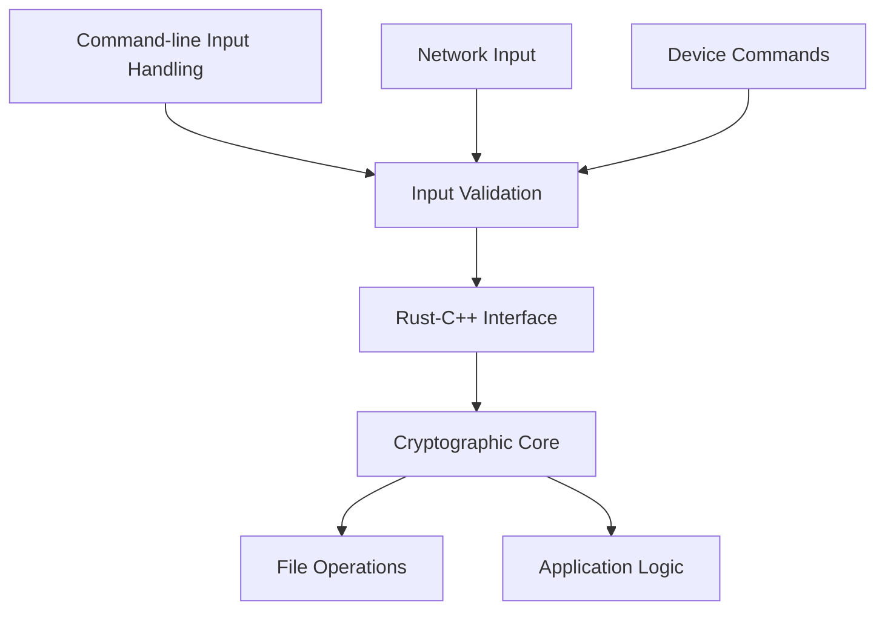
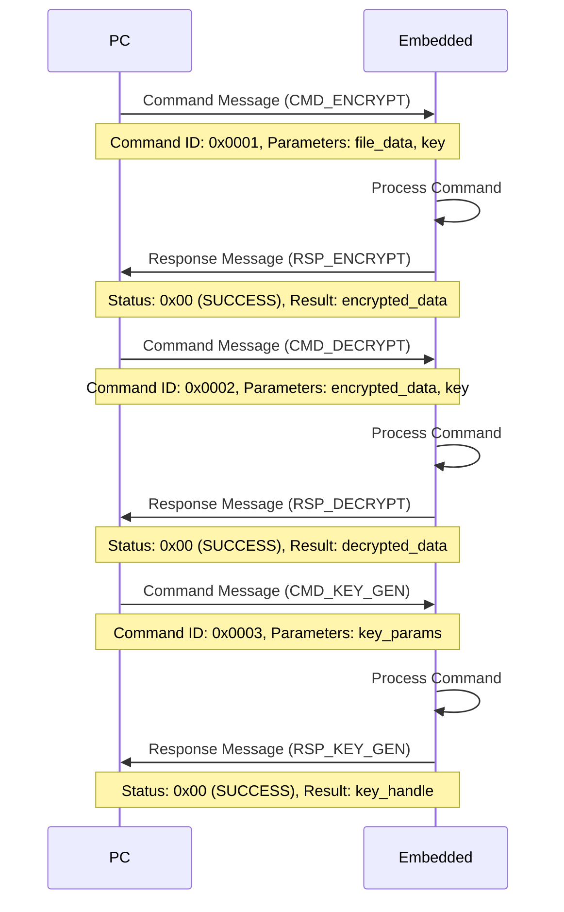
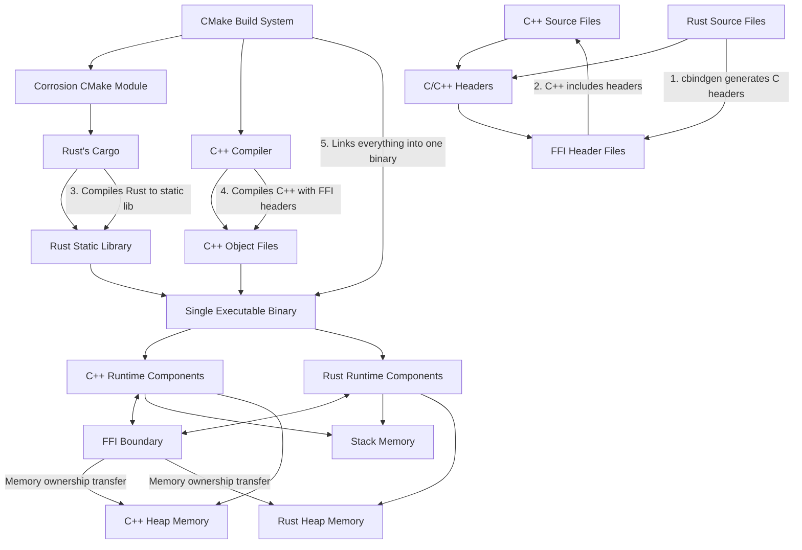

# CRUSTY-Core System Design Document

**Author: Shawn Ahern**  
**Date: March 6, 2025**

## 1. Introduction

This document describes the system design for CRUSTY-Core, a secure file encryption application with dual functionality: a command-line PC application and an embedded deployment on STM32H573I-DK hardware. The architecture leverages Rust for all input handling while maintaining the cryptographic core in C++, combining the memory safety benefits of Rust with the performance and compatibility of C++.

## 2. Architectural Overview

### 2.1 Design Philosophy

The CRUSTY-Core architecture is built on two key principles:

1. **Rust for Input Handling**: All functions that take input from users or other devices (network, input fields, etc.) are implemented in Rust to leverage its memory safety and security features.

2. **C++ for Cryptographic Core**: The core cryptographic operations are implemented in C++ for performance and compatibility with existing libraries and hardware acceleration.

### 2.2 High-Level Architecture



### 2.3 Dual Functionality

CRUSTY-Core supports two deployment targets:

1. **PC Deployment**:
   - Command-line interface for user interaction
   - Local file system access for file operations
   - Local encryption/decryption capabilities
   - Embedded device management functionality

2. **Embedded Deployment (STM32H573I-DK)**:
   - Hardware-based implementation on STM32H573I-DK
   - Hardware acceleration for cryptographic operations
   - Host communication capabilities
   - Embedded encryption service

3. **Shared Components**:
   - Rust input handling for memory safety
   - C++ cryptographic core for performance
   - Communication protocol for PC-embedded interaction

The PC deployment uses the command-line interface to interact with the Rust input handling layer, which then communicates with the C++ cryptographic core for encryption operations. The embedded deployment leverages hardware acceleration while still using the same core cryptographic algorithms, with communication between the PC and embedded device handled through a secure protocol.

## 3. Component Details

### 3.1 Rust Input Handling Layer

The Rust layer is responsible for processing all inputs from users, networks, and devices. This includes:

- Command-line input validation
- Command parsing and validation
- Network protocol handling
- File data validation
- Error handling and reporting

**Example: Input Validation in Rust**

```rust
pub fn validate_user_input(input: &str) -> Result<ValidatedInput, ValidationError> {
    // Check for empty input
    if input.is_empty() {
        return Err(ValidationError::EmptyInput);
    }
    
    // Check for maximum length
    if input.len() > MAX_INPUT_LENGTH {
        return Err(ValidationError::InputTooLong);
    }
    
    // Validate content
    if !input.chars().all(|c| c.is_alphanumeric() || c == '_') {
        return Err(ValidationError::InvalidCharacters);
    }
    
    Ok(ValidatedInput::new(input))
}
```

### 3.2 C++ Cryptographic Core

The C++ layer implements the core cryptographic operations, including:

- AES-256-GCM encryption and decryption
- Key derivation using Argon2
- Key management
- File operations
- Hardware acceleration interface (for embedded target)

**Example: C++ Encryption Function**

```cpp
bool Encryptor::encryptData(const uint8_t* data, size_t dataLen, 
                           const uint8_t* key, size_t keyLen,
                           uint8_t* output, size_t* outputLen) {
    // Initialize encryption context
    AES_GCM_Context ctx;
    if (!initContext(&ctx, key, keyLen)) {
        return false;
    }
    
    // Process data
    return processData(&ctx, data, dataLen, output, outputLen);
}
```

### 3.3 FFI Boundary

The FFI (Foreign Function Interface) boundary defines how Rust and C++ components communicate. It includes:

- Type-safe function signatures
- Memory ownership transfer rules
- Error propagation mechanisms
- Data validation at the boundary

**Example: FFI Interface Definition**

```rust
// Rust side of FFI
#[no_mangle]
pub extern "C" fn validate_and_encrypt(
    input_ptr: *const c_char,
    input_len: usize,
    key_ptr: *const c_char,
    key_len: usize,
    output_ptr: *mut u8,
    output_len: *mut usize
) -> c_int {
    // Convert C inputs to Rust
    let input = unsafe { slice::from_raw_parts(input_ptr as *const u8, input_len) };
    let key = unsafe { slice::from_raw_parts(key_ptr as *const u8, key_len) };
    
    // Validate input
    if let Err(_) = validate_input(input) {
        return ERROR_INVALID_INPUT;
    }
    
    // Call C++ encryption function
    unsafe {
        cpp_encrypt_data(input.as_ptr(), input.len(), 
                        key.as_ptr(), key.len(),
                        output_ptr, output_len)
    }
}
```

## 4. PC Deployment

### 4.1 Command-Line Interface

The PC deployment includes a command-line interface that provides:

- File selection for encryption/decryption via path arguments
- Password input via secure prompt or file
- Progress reporting to standard output
- Embedded device management through specific commands

All user inputs from the command line are passed to the Rust layer for validation before being processed.

**Example: Command-Line Usage**

```
crusty-core encrypt --input file.txt --output file.enc --password-prompt
crusty-core decrypt --input file.enc --output file.txt --password-file key.txt
crusty-core device-list
crusty-core device-install --firmware firmware.bin --device /dev/ttyUSB0
```

### 4.2 Local Encryption

The PC deployment supports local encryption using the C++ cryptographic core. This provides:

- File encryption/decryption on the local file system
- Password-based key derivation
- Progress reporting and error handling

### 4.3 Embedded Device Management

The PC application includes features for managing connected embedded devices:

- Device detection and connection
- Firmware installation and configuration
- Encryption service requests
- Key management

**Example: Embedded Device Detection**

```cpp
std::vector<DeviceInfo> EmbeddedDeviceManager::detectDevices() {
    std::vector<DeviceInfo> devices;
    
    // Scan for USB devices
    auto usbDevices = scanUsbDevices();
    for (const auto& dev : usbDevices) {
        if (isStm32h5Device(dev)) {
            devices.push_back(createDeviceInfo(dev));
        }
    }
    
    return devices;
}
```

## 5. Embedded Deployment

### 5.1 STM32H573I-DK Hardware

The embedded deployment runs on STM32H573I-DK hardware, which provides:

- ARM Cortex-M7 processor
- Hardware cryptographic accelerators
- Secure storage
- Communication interfaces (USB, UART)

### 5.2 Hardware Acceleration

The embedded deployment leverages the STM32H5's hardware cryptographic accelerators for improved performance:

- AES-GCM hardware acceleration
- SHA hardware acceleration
- True random number generation

**Example: Hardware Acceleration Interface**

```cpp
bool initHardwareAccelerator(EncryptionContext* context) {
    // Configure AES-GCM hardware
    HAL_CRYP_Init(&context->hcryp);
    
    // Set key
    if (HAL_CRYP_SetKey(&context->hcryp, context->key, context->keyLen) != HAL_OK) {
        return false;
    }
    
    // Set IV
    return HAL_CRYP_SetInitVector(&context->hcryp, context->iv, 12) == HAL_OK;
}
```

### 5.3 Host Communication

The embedded deployment communicates with the host PC through a secure protocol implemented in Rust:

- Command reception and parsing
- Response formatting
- Error handling
- Flow control

### 5.4 Embedded Encryption Service

The embedded device provides encryption services to the connected host:

- File encryption/decryption
- Key management
- Secure operations

## 6. Communication Protocol

### 6.1 Protocol Overview

The communication protocol between PC and embedded device is implemented in Rust and follows a command-response pattern:



### 6.2 Message Format

Messages follow a binary format with headers, payloads, and checksums:

```
Command Message:
[2 bytes: Magic] [1 byte: Type] [4 bytes: Length] [4 bytes: Command ID] [Variable: Payload] [2 bytes: CRC]

Response Message:
[2 bytes: Magic] [1 byte: Type] [4 bytes: Length] [4 bytes: Command ID] [1 byte: Status] [Variable: Payload] [2 bytes: CRC]
```

### 6.3 Command Processing

Commands are processed through a pipeline that ensures security at each step:

```mermaid
graph LR
    A[Receive Message<br>receiveData(buffer, len)] --> B[Validate Format<br>validateMessageFormat(buffer)]
    B --> C[Parse Command<br>cmd = parseCommand(buffer)]
    C --> D[Validate Parameters<br>validateParams(cmd.params)]
    D --> E[Execute Command<br>result = executeCommand(cmd)]
    E --> F[Format Response<br>resp = formatResponse(result)]
    F --> G[Send Response<br>sendResponse(resp)]
    
    classDef code fill:#f9f9f9,stroke:#333,stroke-width:1px;
    class A,B,C,D,E,F,G code;
```

## 7. Build System

### 7.1 Unified Build System

The build system supports both PC and embedded targets from a single codebase:

- CMake as the primary build orchestrator
- Corrosion for Rust integration
- Conditional compilation for target-specific code

**Example: CMake Configuration for Dual Targets**

```cmake
# Common components
add_library(cpp_crypto_core
    src/cpp/crypto/encryptor.cpp
    src/cpp/crypto/key_management.cpp
)

# Conditional compilation for PC target
if(BUILD_PC_TARGET)
    add_executable(crusty_qt src/cpp/main.cpp)
    target_link_libraries(crusty_qt PRIVATE 
        cpp_crypto_core
        qt_ui
        rust_input_pc
    )
endif()

# Conditional compilation for embedded target
if(BUILD_EMBEDDED_TARGET)
    add_executable(crusty_embedded src/cpp/embedded_main.cpp)
    target_link_libraries(crusty_embedded PRIVATE 
        cpp_crypto_core
        rust_input_embedded
    )
endif()
```

### 7.2 Rust Conditional Compilation

Rust code uses feature flags for conditional compilation:

**Example: Rust Conditional Compilation**

```rust
#[cfg(feature = "std")]
pub fn pc_specific_function() {
    // PC-specific implementation using std library
    std::fs::File::open("config.txt").unwrap();
}

#[cfg(not(feature = "std"))]
pub fn embedded_specific_function() {
    // Embedded-specific implementation without std
    // Uses no_std compatible alternatives
}
```

## 8. Security Considerations

### 8.1 Memory Safety

Rust's ownership model ensures memory safety for all input handling:

- No buffer overflows
- No use-after-free vulnerabilities
- No data races
- Explicit error handling

The C++ code follows NSA secure coding practices for memory safety:

- Smart pointers (std::unique_ptr, std::shared_ptr) for automatic resource management
- RAII patterns to ensure proper cleanup
- Bounds checking for all array and buffer operations
- SecureData template with automatic memory wiping for sensitive data
- Avoiding raw pointers and manual memory management

### 8.2 Input Validation

All inputs are validated in Rust before processing:

- Type checking
- Range validation
- Format validation
- Sanitization

Input validation follows these principles:

- All inputs are validated at trust boundaries
- Allowlist validation is used rather than blocklists
- Input validation is applied consistently across all entry points
- Validation failures result in secure error states
- Path sanitization prevents directory traversal attacks

### 8.3 Secure Communication

Communication between PC and embedded device is secured:

- Message authentication
- Encryption for sensitive data
- Protection against replay attacks
- Error detection

Communication security is enhanced with:

- Secure protocol with version negotiation
- Session-based authentication
- Integrity checking for all messages
- Timeout and retry mechanisms with secure failure modes
- Protection against man-in-the-middle attacks

### 8.4 Hardware Security

The STM32H5 provides hardware security features:

- Secure boot
- Secure storage
- Hardware isolation
- Side-channel attack countermeasures

Additional hardware security measures include:

- Memory Protection Unit (MPU) configuration to isolate sensitive operations
- Disabling debug interfaces in production builds
- Countermeasures against timing and power analysis attacks
- Secure key storage in isolated memory regions
- Hardware-based random number generation

### 8.5 Compiler Hardening

The build system enables compiler security flags to enhance protection:

- Stack protection mechanisms to prevent buffer overflow attacks
- Address Space Layout Randomization (ASLR) for increased memory access security
- Data Execution Prevention (DEP) to prevent code execution from data pages
- Control Flow Guard to prevent hijacking of program control flow
- Position Independent Executable (PIE) support for enhanced security

### 8.6 Error Handling

Comprehensive error handling ensures secure operation:

- All predictable exceptions are identified and handled
- Error messages don't disclose sensitive information
- Graceful degradation in case of errors
- Secure default states on failure
- Comprehensive logging of security-relevant errors

## 9. Performance Considerations

### 9.1 Chunked Processing

Large files are processed in chunks to manage memory usage:

```mermaid
graph TD
    A[Input File] --> B[Split into Chunks<br>chunk_size = 1MB]
    B --> C[Process Chunk 1<br>encryptChunk(chunk1, key)]
    B --> D[Process Chunk 2<br>encryptChunk(chunk2, key)]
    B --> E[Process Chunk N<br>encryptChunk(chunkN, key)]
    C --> F[Combine Results<br>combineEncryptedChunks()]
    D --> F
    E --> F
    F --> G[Output File<br>writeEncryptedFile()]
    
    classDef code fill:#f9f9f9,stroke:#333,stroke-width:1px;
    class B,C,D,E,F,G code;
```

### 9.2 Hardware Acceleration

The embedded target leverages hardware acceleration for improved performance:

- AES-GCM hardware accelerator for encryption/decryption
- SHA hardware accelerator for hashing
- DMA for efficient data transfer

### 9.3 Parallel Processing

The PC target uses parallel processing for large files:

- Multiple threads for chunk processing
- Progress reporting across threads
- Synchronization for result combination

## 10. User Experience

### 10.1 Command-Line Interface

The command-line interface provides a streamlined user experience:

- Simple and consistent command structure
- Clear progress reporting with percentage and estimated time
- Detailed error messages with suggestions for resolution
- Help system with examples and documentation
- Support for both interactive and scripted usage

**Example: Command-Line Help**

```
CRUSTY-Core - Secure File Encryption

USAGE:
    crusty-core [COMMAND] [OPTIONS]

COMMANDS:
    encrypt     Encrypt a file
    decrypt     Decrypt a file
    device      Manage embedded devices
    key         Manage encryption keys
    help        Display help information

For more information on a specific command, run:
    crusty-core [COMMAND] --help
```

### 10.2 Encryption Modes

Users can choose between local and embedded encryption:

```mermaid
graph TD
    A[User Specifies File<br>--input file.txt] --> B[Choose Encryption Mode<br>--mode local|embedded]
    B --> C[Local Encryption<br>mode = EncryptionMode::Local]
    B --> D[Embedded Encryption<br>mode = EncryptionMode::Embedded]
    C --> E[Process Locally<br>encryptor.encryptFile(file, key)]
    D --> F[Select Device<br>device = findDevice(deviceId)]
    F --> G[Send to Device<br>device.sendCommand(CMD_ENCRYPT)]
    G --> H[Process on Device<br>device.waitForResponse()]
    E --> I[Save Encrypted File<br>writeToFile(encryptedData)]
    H --> I
    
    classDef code fill:#f9f9f9,stroke:#333,stroke-width:1px;
    class A,B,C,D,E,F,G,H,I code;
```

### 10.3 Embedded Installation

The command-line interface provides commands for installing CRUSTY-Core on embedded devices:

- Device detection with `device-list` command
- Firmware installation with `device-install` command
- Configuration with `device-configure` command
- Verification with `device-verify` command

**Example: Device Management Commands**

```
# List available devices
crusty-core device list

# Install firmware on a device
crusty-core device install --firmware firmware.bin --device /dev/ttyUSB0

# Configure a device
crusty-core device configure --device /dev/ttyUSB0 --config config.json

# Verify device installation
crusty-core device verify --device /dev/ttyUSB0
```

## 11. Conclusion

The CRUSTY-Core system design leverages the strengths of both Rust and C++ to create a secure, high-performance file encryption application with dual functionality. By using Rust for all input handling and C++ for the cryptographic core, the system achieves both memory safety and performance.

The dual-target architecture supports both PC and embedded deployments, providing flexibility and enhanced security options. The ability to offload encryption to a dedicated STM32H5 device provides additional security benefits for sensitive operations, while the local encryption option ensures convenience for everyday use.

## 12. Development Plan

### 12.1 Current Status Overview

The CRUSTy-Core project has established its core architecture and implemented basic encryption/decryption functionality. The hybrid C++/Rust approach is working well, with Rust handling input validation and C++ providing the cryptographic core. The project is now focused on a command-line interface approach, removing the Qt UI dependency until further notice.

Key accomplishments:
- Core architecture with C++/Rust integration is implemented
- AES-256-GCM encryption with Argon2 key derivation is functional
- File operations and encryption/decryption are working
- FFI boundary between C++ and Rust is defined and functional

Current challenges:
- Command-line interface needs to be implemented
- Embedded target implementation has not been started
- Comprehensive security features need to be completed

### 12.2 Revised Development Phases

#### Phase 1: Project Setup and Core Architecture

**Current Status:** ✅ COMPLETED
- Project structure, build system, and interface definitions are in place
- FFI boundary between C++ and Rust is defined and functional
- CMake build system with Corrosion integration is working

**Objectives:**
- Fork the CRUSTy repository and establish the new project structure
- Define the interface between C++ and Rust components
- Set up the dual-target build system for PC and embedded deployments

**Key Deliverables:**
- Project repository with initial structure and build system
- Interface definitions for cross-language communication
- Build configuration for both PC and STM32H5 targets

**Technical Approach:**
The FFI boundary has been carefully designed to ensure type safety and memory safety across language boundaries. The interface includes functions for data encryption/decryption, password hashing, and key derivation. A C++ wrapper class provides a clean, object-oriented interface to the Rust input handling functions. The build system supports conditional compilation for both PC and embedded targets.

#### Phase 2A: Command-Line Interface Implementation

**Current Status:** 🔄 IN PROGRESS
- Basic file operations are implemented
- Command-line argument parsing needs to be implemented
- Progress reporting and error handling need improvement

**Objectives:**
- Implement command-line argument parsing
- Create a consistent command structure
- Implement batch processing for multiple files
- Add progress reporting to standard output
- Implement key management commands

**Key Deliverables:**
- Fully functional command-line interface
- Batch processing for encrypting/decrypting multiple files
- Progress reporting with percentage and estimated time
- Key management functionality for generating, saving, and loading encryption keys
- Comprehensive help system with examples

**Technical Approach:**
The command-line interface will use a modern argument parsing library to handle command-line options. The interface will follow a consistent command structure with subcommands for different operations. Batch processing will be implemented to handle multiple files with a single command. Progress reporting will provide real-time updates to standard output. Key management will provide functionality for generating, saving, and loading encryption keys.

#### Phase 2B: Implement Enhanced Security Features

**Current Status:** ⚠️ PARTIALLY IMPLEMENTED
- Basic security features are implemented
- Password strength validation needs enhancement
- Key management is not implemented

**Objectives:**
- Enhance password strength requirements
- Implement secure key storage
- Add encryption metadata and verification
- Implement NSA secure coding practices

**Key Deliverables:**
- Enhanced password strength validation
- Secure key storage with proper encryption
- File metadata for verification and integrity checking
- Comprehensive implementation of NSA secure coding practices

**Technical Approach:**
Password strength requirements will be enhanced with better validation. Secure key storage will use proper encryption for storing keys on disk. Encryption metadata will be added to encrypted files to support verification and integrity checking. NSA secure coding practices will be implemented throughout the codebase, including memory safety, input validation, error handling, compiler hardening, and secure logging.

#### Phase 3: Dual-Target Implementation

**Current Status:** ❌ NOT STARTED
- Embedded target functionality is defined but not implemented
- Communication protocol between PC and embedded device is not implemented
- Hardware acceleration for cryptographic operations is not implemented

**Objectives:**
- Implement the embedded firmware for STM32H573I-DK
- Develop the communication protocol between PC and embedded device
- Implement hardware acceleration for cryptographic operations
- Add device management commands to the command-line interface

**Key Deliverables:**
- Functional embedded firmware for STM32H573I-DK
- Secure communication protocol between PC and embedded device
- Hardware-accelerated encryption on embedded device
- Command-line interface for installing and configuring embedded firmware

**Technical Approach:**
The embedded implementation will leverage the STM32H5 cryptographic hardware accelerators for improved performance. The communication protocol will be implemented in Rust with a focus on security and reliability. The command-line interface will include commands for detecting, installing, and configuring the embedded firmware.

#### Phase 4: Performance Optimization and Testing

**Current Status:** ❌ NOT STARTED
- Performance optimization for large files is implemented with chunking
- Comprehensive testing and documentation are not complete

**Objectives:**
- Optimize performance for large files on both PC and embedded targets
- Implement parallel processing for improved performance
- Conduct comprehensive testing on both platforms
- Create user and developer documentation

**Key Deliverables:**
- Optimized file handling for large files
- Parallel processing for improved performance
- Comprehensive test suite for both PC and embedded targets
- Complete user and developer documentation

**Technical Approach:**
Performance optimization will include file chunking for large files and parallel processing where appropriate. A comprehensive testing strategy will ensure both the C++ and Rust components function correctly and securely across both deployment targets. Documentation will include a user guide, developer setup guide, and API reference.

### 12.3 Technical Highlights

#### Cross-Language Integration

The integration between C++ and Rust will be handled through a carefully designed Foreign Function Interface (FFI). This interface will:

- Define clear boundaries between language domains
- Ensure type safety across language boundaries
- Handle memory management safely between languages
- Provide error propagation mechanisms
- Support complex data structures through serialization
- Maintain consistent behavior across PC and embedded targets

#### Dual-Target Architecture

The dual-target architecture supports both PC and embedded deployments:

1. **PC Deployment**:
   - Command-line interface for user interaction
   - Local file encryption/decryption
   - Option to offload encryption to connected embedded device
   - Ability to install and configure embedded firmware

2. **Embedded Deployment (STM32H573I-DK)**:
   - Runs on STM32H573I-DK hardware
   - Provides encryption services to connected host
   - Leverages hardware acceleration for cryptographic operations
   - Communicates via secure protocol with host

#### Rust Input Handling

All user inputs and external communications are handled in Rust to leverage its memory safety features:

- Command-line arguments and user input
- Network commands and data
- Device communications
- File data validation
- Command parsing and validation

This approach significantly enhances security by ensuring that all untrusted input is processed through Rust's memory-safe environment before reaching the C++ core.

### 12.4 FFI, CMake, and Corrosion Integration

The following diagram illustrates in detail how FFI, CMake, and Corrosion work together to integrate C++ and Rust code into a single binary:



#### Key Integration Components

1. **FFI (Foreign Function Interface)**:
   - Defines the boundary between C++ and Rust code
   - Specifies function signatures that are compatible across languages
   - Handles type conversions between Rust and C++ types
   - Manages memory ownership transfer between language runtimes
   - Provides error propagation mechanisms

2. **CMake Build System**:
   - Serves as the primary build orchestrator
   - Configures the build environment for both C++ and Rust
   - Manages dependencies and build order
   - Handles platform-specific build settings
   - Invokes the appropriate compilers and linkers

3. **Corrosion CMake Module**:
   - Integrates Rust's Cargo build system with CMake
   - Automatically generates CMake targets for Rust crates
   - Handles Rust compilation flags and feature configuration
   - Ensures Rust libraries are built with the correct settings
   - Makes Rust artifacts available to the CMake linking process

4. **cbindgen**:
   - Analyzes Rust code to generate C/C++ compatible headers
   - Ensures type definitions are consistent across language boundaries
   - Handles complex type mappings between Rust and C++
   - Generates documentation for FFI functions
   - Supports attributes for customizing the generated headers

5. **Static Linking Process**:
   - Rust code is compiled to a static library (.a/.lib)
   - C++ code is compiled to object files
   - The linker combines all objects into a single executable
   - Symbol resolution happens across language boundaries
   - Results in a single binary with no external dependencies on Rust

6. **Runtime Integration**:
   - Both language runtimes coexist in the same process
   - Memory is shared through carefully defined interfaces
   - Stack frames can interleave between languages
   - Heap allocations are managed by their respective language
   - Ownership transfer is explicit at FFI boundaries
