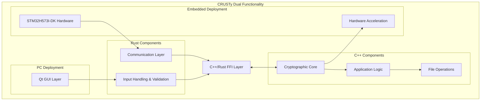
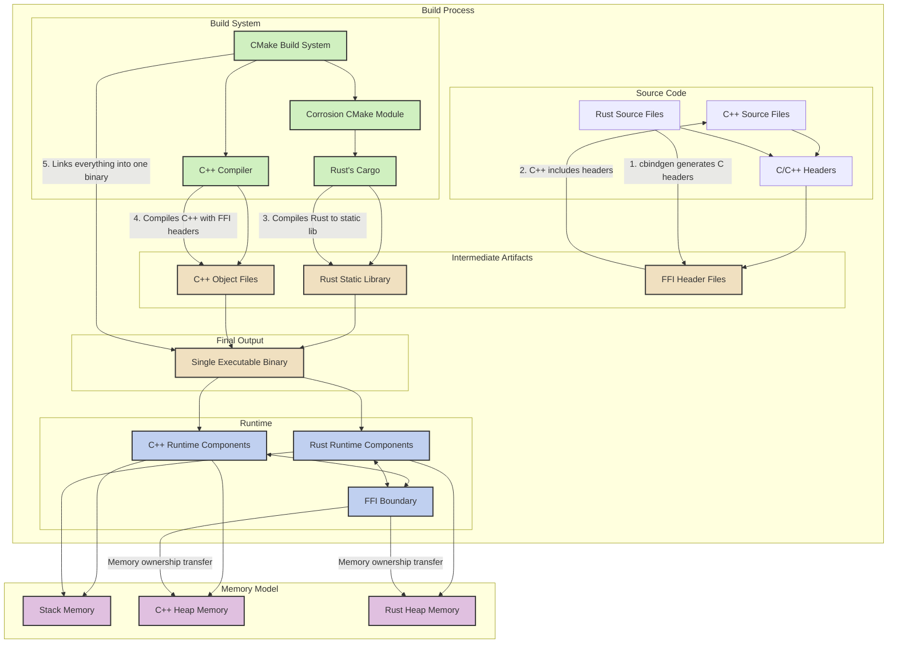

# CRUSTy Development Plan

**Author: Shawn Ahern**  
**Date: March 6, 2025**  
**Last Updated: March 6, 2025**

## Executive Summary

This document outlines the development plan for CRUSTy, a hybrid C++/Rust implementation of the file encryption application. This version (maintained in the CRUSTy-Core repository) will maintain the core security features of the original CRUSTy while implementing a modern Qt-based user interface. The initial version will focus on single file encryption with password-based encryption and decryption.

The development approach leverages a hybrid architecture that combines C++ for the user interface and application logic (90%) with Rust for security-critical cryptographic operations (10%). This approach balances developer familiarity and enterprise compatibility with the memory safety benefits of Rust for security-sensitive code.

## Current Status Overview

The CRUSTy-Core project has established its core architecture and implemented basic encryption/decryption functionality. The hybrid C++/Rust approach is working well, with Rust handling cryptographic operations and C++ providing the application framework and UI. However, many UI features are defined but not fully implemented, and the embedded target implementation has not been started.

Key accomplishments:
- Core architecture with C++/Rust integration is implemented
- AES-256-GCM encryption with Argon2 key derivation is functional
- Basic Qt UI framework is in place
- File operations and encryption/decryption are working

Current challenges:
- Qt DLL dependency issue: Qt DLLs are not automatically copied to the build directory
- Many UI features are defined but show "not yet implemented" messages
- Embedded target implementation has not been started

## Architectural Overview

CRUSTy follows a revised architecture that leverages Rust for all input handling while maintaining the cryptographic core in C++. This architecture supports dual functionality: a PC application with Qt UI and an embedded deployment on STM32H573I-DK hardware.

### Key Components

1. **Rust Input Handling**: All user inputs, network commands, and device communications are processed in Rust to leverage its memory safety and security features.

2. **C++ Cryptographic Core**: Core encryption and decryption operations implemented in C++, with optimizations for both PC and embedded platforms.

3. **Qt GUI Layer**: A modern, cross-platform user interface built with Qt 6, providing intuitive file selection and encryption/decryption workflows.

4. **Application Logic**: Core business logic implemented in C++, managing the overall application flow, state, and coordinating between UI and cryptographic operations.

5. **File Operations**: Handles file reading, writing, and metadata management, implemented in C++ for compatibility with enterprise systems.

6. **Communication Layer**: Rust-based communication protocols for interaction between PC and embedded systems.

7. **Hardware Acceleration**: Leverages STM32H5 cryptographic hardware accelerators for improved performance on embedded deployments.

8. **FFI Layer**: A carefully designed Foreign Function Interface that enables secure and efficient communication between C++ and Rust components.

## Revised Development Phases

### Phase 1: Project Setup and Core Architecture

**Current Status:** ✅ COMPLETED
- Project structure, build system, and interface definitions are in place
- FFI boundary between C++ and Rust is defined and functional
- CMake build system with Corrosion integration is working
- Basic Qt application shell is implemented

**Objectives:**
- Fork the CRUSTy repository and establish the new project structure
- Define the interface between C++ and Rust components
- Set up the dual-target build system for PC and embedded deployments
- Set up the basic Qt application framework

**Key Deliverables:**
- Project repository with initial structure and build system
- Interface definitions for cross-language communication
- Build configuration for both PC and STM32H5 targets
- Basic Qt application shell with placeholder UI

**Technical Approach:**
The FFI boundary will be carefully designed to ensure type safety and memory safety across language boundaries. The interface will include functions for data encryption/decryption, password hashing, and key derivation. A C++ wrapper class will provide a clean, object-oriented interface to the Rust input handling functions. The build system will support conditional compilation for both PC and embedded targets.

### Phase 2A: Complete Basic UI Implementation

**Current Status:** ⚠️ PARTIALLY COMPLETED
- Basic encryption/decryption UI is implemented
- File operations are implemented but file browser functionality is incomplete
- Many UI features show "not yet implemented" messages
- Qt DLL dependency issue exists

**Objectives:**
- Complete the file browser functionality
- Implement batch processing for multiple files
- Implement settings dialog
- Implement key management
- Resolve Qt DLL dependency issue
- Remove unnecessary UI elements

**Key Deliverables:**
- Fully functional file browser with proper directory navigation
- Batch processing for encrypting/decrypting multiple files
- Settings dialog for configuring application preferences
- Key management interface for generating, saving, and loading encryption keys
- Deployment configuration to handle Qt DLL dependencies
- Clean UI without unnecessary elements

**Technical Approach:**
The file browser will be enhanced to support proper directory navigation and file selection. Batch processing will be implemented to handle multiple files with a single operation. The settings dialog will allow users to configure application preferences such as default directories and UI options. Key management will provide functionality for generating, saving, and loading encryption keys. A post-build step will be added to the CMake configuration to copy required Qt DLLs to the build directory. Unnecessary UI elements will be removed to simplify the interface.

### Phase 2B: Implement Enhanced Security Features

**Current Status:** ⚠️ PARTIALLY IMPLEMENTED
- Basic security features are implemented
- Password strength meter is implemented but could be enhanced
- Key management is not implemented

**Objectives:**
- Enhance password strength requirements
- Implement secure key storage
- Add encryption metadata and verification

**Key Deliverables:**
- Enhanced password strength validation and feedback
- Secure key storage with proper encryption
- File metadata for verification and integrity checking

**Technical Approach:**
Password strength requirements will be enhanced with better validation and feedback. Secure key storage will use proper encryption for storing keys on disk. Encryption metadata will be added to encrypted files to support verification and integrity checking.

### Phase 3: Dual-Target Implementation

**Current Status:** ❌ NOT STARTED
- Embedded target functionality is defined in the UI but not implemented
- Communication protocol between PC and embedded device is not implemented
- Hardware acceleration for cryptographic operations is not implemented

**Objectives:**
- Implement the embedded firmware for STM32H573I-DK
- Develop the communication protocol between PC and embedded device
- Implement hardware acceleration for cryptographic operations
- Add "Install CRUSTy-Core on Embedded System" feature to PC application

**Key Deliverables:**
- Functional embedded firmware for STM32H573I-DK
- Secure communication protocol between PC and embedded device
- Hardware-accelerated encryption on embedded device
- PC application feature for installing and configuring embedded firmware

**Technical Approach:**
The embedded implementation will leverage the STM32H5 cryptographic hardware accelerators for improved performance. The communication protocol will be implemented in Rust with a focus on security and reliability. The PC application will include features for detecting, installing, and configuring the embedded firmware.

### Phase 4: Polish and Optimization

**Current Status:** ❌ NOT STARTED
- Some UI theming is implemented with a stylesheet
- Performance optimization for large files is implemented with chunking
- Comprehensive testing and documentation are not complete

**Objectives:**
- Complete UI theming and usability enhancements
- Optimize performance for large files on both PC and embedded targets
- Conduct comprehensive testing on both platforms
- Create user and developer documentation

**Key Deliverables:**
- Polished user interface with theming support
- Optimized file handling for large files
- Comprehensive test suite for both PC and embedded targets
- Complete user and developer documentation

**Technical Approach:**
Performance optimization will include file chunking for large files and parallel processing where appropriate. The UI will be enhanced with theming support and improved layouts. A comprehensive testing strategy will ensure both the C++ and Rust components function correctly and securely across both deployment targets.

## Technical Highlights

### Cross-Language Integration

The integration between C++ and Rust will be handled through a carefully designed Foreign Function Interface (FFI). This interface will:

- Define clear boundaries between language domains
- Ensure type safety across language boundaries
- Handle memory management safely between languages
- Provide error propagation mechanisms
- Support complex data structures through serialization
- Maintain consistent behavior across PC and embedded targets

### Dual-Target Architecture

The dual-target architecture supports both PC and embedded deployments:

1. **PC Deployment**:
   - Full Qt GUI for user interaction
   - Local file encryption/decryption
   - Option to offload encryption to connected embedded device
   - Ability to install and configure embedded firmware

2. **Embedded Deployment (STM32H573I-DK)**:
   - Runs on STM32H573I-DK hardware
   - Provides encryption services to connected host
   - Leverages hardware acceleration for cryptographic operations
   - Communicates via secure protocol with host

### Rust Input Handling

All user inputs and external communications are handled in Rust to leverage its memory safety features:

- User input from GUI components
- Network commands and data
- Device communications
- File data validation
- Command parsing and validation

This approach significantly enhances security by ensuring that all untrusted input is processed through Rust's memory-safe environment before reaching the C++ core.

## FFI, CMake, and Corrosion Integration

The following diagram illustrates in detail how FFI, CMake, and Corrosion work together to integrate C++ and Rust code into a single binary:

### Key Integration Components

1. **FFI (Foreign Function Interface)**:
   - Defines the boundary between C++ and Rust code
   - Specifies function signatures that are compatible across languages
   - Handles type conversions between Rust and C++ types
   - Manages memory ownership transfer between language runtimes
   - Provides error propagation mechanisms

2. **CMake Build System**:
   - Serves as the primary build orchestrator
   - Configures the build environment for both C++ and Rust
   - Manages dependencies and build order
   - Handles platform-specific build settings
   - Invokes the appropriate compilers and linkers

3. **Corrosion CMake Module**:
   - Integrates Rust's Cargo build system with CMake
   - Automatically generates CMake targets for Rust crates
   - Handles Rust compilation flags and feature configuration
   - Ensures Rust libraries are built with the correct settings
   - Makes Rust artifacts available to the CMake linking process

4. **cbindgen**:
   - Analyzes Rust code to generate C/C++ compatible headers
   - Ensures type definitions are consistent across language boundaries
   - Handles complex type mappings between Rust and C++
   - Generates documentation for FFI functions
   - Supports attributes for customizing the generated headers

5. **Static Linking Process**:
   - Rust code is compiled to a static library (.a/.lib)
   - C++ code is compiled to object files
   - The linker combines all objects into a single executable
   - Symbol resolution happens across language boundaries
   - Results in a single binary with no external dependencies on Rust

6. **Runtime Integration**:
   - Both language runtimes coexist in the same process
   - Memory is shared through carefully defined interfaces
   - Stack frames can interleave between languages
   - Heap allocations are managed by their respective language
   - Ownership transfer is explicit at FFI boundaries

## Updated Development Prompts by Phase

### Phase 2A Prompts: Complete Basic UI Implementation

1. "Let's implement the file browser functionality in MainWindow::refreshFileList() to properly navigate directories and display file information."
   - This will enhance the file browser to support proper directory navigation and file selection.

2. "I need to implement batch processing in MainWindow::processBatch() to handle multiple files with a single operation."
   - This will enable users to encrypt or decrypt multiple files at once.

3. "Let's create a settings dialog to allow users to configure application preferences such as default directories and UI options."
   - This will provide a way for users to customize the application behavior.

4. "I need to implement key management functionality for generating, saving, and loading encryption keys."
   - This will enhance security by allowing users to manage encryption keys separately from passwords.

5. "Let's add a post-build step to the CMake configuration to copy required Qt DLLs to the build directory."
   - This will resolve the Qt DLL dependency issue and ensure the application runs without manual DLL copying.

6. "I need to remove unnecessary UI elements to simplify the interface."
   - This will clean up the UI and remove features that are not needed.

7. "Let's implement the 'Actions' section in the file details panel to provide quick access to common operations."
   - This will improve usability by providing context-specific actions for selected files.

### Phase 2B Prompts: Implement Enhanced Security Features

8. "I need to enhance password strength requirements with better validation and feedback in the PasswordStrengthMeter class."
   - This will help users create stronger passwords and improve security.

9. "Let's implement secure key storage with proper encryption for storing keys on disk."
   - This will protect encryption keys from unauthorized access.

10. "I need to add encryption metadata to encrypted files to support verification and integrity checking."
    - This will enhance security by ensuring encrypted files have not been tampered with.

11. "Let's implement a secure password hashing mechanism using Argon2 for key derivation."
    - This will improve security by using a modern, secure password hashing algorithm.

### Phase 3 Prompts: Dual-Target Implementation

12. "I need to implement the embedded firmware for STM32H573I-DK with hardware-accelerated encryption."
    - This will enable the embedded target functionality with improved performance.

13. "Let's develop a secure communication protocol between the PC and embedded device."
    - This will enable secure interaction between the PC application and the embedded device.

14. "I need to implement hardware acceleration for cryptographic operations on the STM32H5 platform."
    - This will improve performance by leveraging the hardware cryptographic accelerators.

15. "Let's add the 'Install CRUSTy-Core on Embedded System' feature to the PC application."
    - This will enable users to install and configure the embedded firmware from the PC application.

16. "I need to implement device detection and connection management for embedded devices."
    - This will enable the PC application to detect and connect to embedded devices.

### Phase 4 Prompts: Polish and Optimization

17. "Let's complete the UI theming with a consistent look and feel across all components."
    - This will improve the visual appeal and usability of the application.

18. "I need to optimize file handling for large files with efficient chunking and parallel processing."
    - This will improve performance when working with large files.

19. "Let's implement comprehensive testing for all features to ensure reliability and security."
    - This will ensure the application works correctly and securely.

20. "I need to complete the user and developer documentation."
    - This will provide comprehensive documentation for both users and developers.

## Conclusion

The CRUSTy project represents a strategic evolution of our file encryption capabilities, combining the security benefits of Rust for input handling with the enterprise compatibility of C++ for cryptographic operations. The dual-target architecture supports both PC and embedded deployments, providing flexibility and enhanced security options.

By leveraging Rust's memory safety for all input processing and C++'s performance for cryptographic operations, we create a secure, user-friendly application that meets our enterprise requirements while maintaining the highest security standards. The ability to offload encryption to a dedicated STM32H5 device provides additional security benefits for sensitive operations, while the local encryption option ensures convenience for everyday use.
