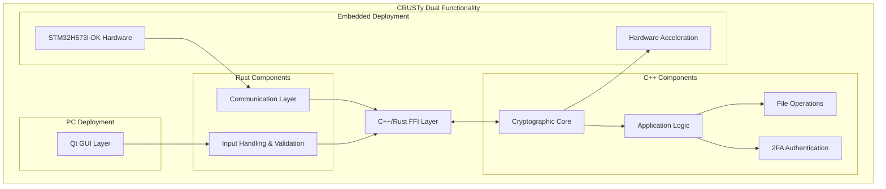
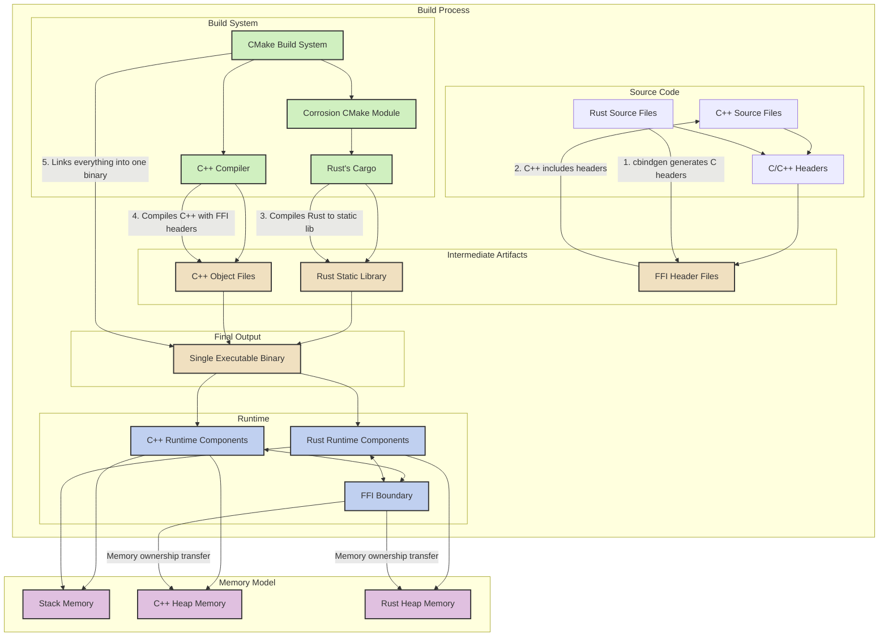

# CRUSTy Development Plan

**Author: Shawn Ahern**  
**Date: March 4, 2025**

## Executive Summary

This document outlines the development plan for CRUSTy, a hybrid C++/Rust implementation of the file encryption application. This version (maintained in the CRUSTy-Core repository) will maintain the core security features of the original CRUSTy while implementing a modern Qt-based user interface and adding two-factor authentication for enhanced security. The initial version will focus on single file encryption with password-based 2FA for decryption.

The development approach leverages a hybrid architecture that combines C++ for the user interface and application logic (90%) with Rust for security-critical cryptographic operations (10%). This approach balances developer familiarity and enterprise compatibility with the memory safety benefits of Rust for security-sensitive code.

## Architectural Overview

CRUSTy will follow a revised architecture that leverages Rust for all input handling while maintaining the cryptographic core in C++. This architecture supports dual functionality: a PC application with Qt UI and an embedded deployment on STM32H573I-DK hardware.

### Key Components

1. **Rust Input Handling**: All user inputs, network commands, and device communications are processed in Rust to leverage its memory safety and security features.

2. **C++ Cryptographic Core**: Core encryption and decryption operations implemented in C++, with optimizations for both PC and embedded platforms.

3. **Qt GUI Layer**: A modern, cross-platform user interface built with Qt 6, providing intuitive file selection, encryption/decryption workflows, and 2FA input.

4. **Application Logic**: Core business logic implemented in C++, managing the overall application flow, state, and coordinating between UI and cryptographic operations.

5. **File Operations**: Handles file reading, writing, and metadata management, implemented in C++ for compatibility with enterprise systems.

6. **2FA Authentication**: Implements Time-based One-Time Password (TOTP) verification as a second authentication factor for enhanced security.

7. **Communication Layer**: Rust-based communication protocols for interaction between PC and embedded systems.

8. **Hardware Acceleration**: Leverages STM32H5 cryptographic hardware accelerators for improved performance on embedded deployments.

9. **FFI Layer**: A carefully designed Foreign Function Interface that enables secure and efficient communication between C++ and Rust components.

## Development Phases

### Phase 1: Project Setup and Core Architecture

**Objectives:**
- Fork the CRUSTy repository and establish the new project structure
- Define the interface between C++ and Rust components
- Set up the dual-target build system for PC and embedded deployments
- Set up the basic Qt application framework

**Key Deliverables:**
- Project repository with initial structure and build system
- Interface definitions for cross-language communication
- Build configuration for both PC and STM32H5 targets
- Basic Qt application shell with placeholder UI

**Technical Approach:**
The FFI boundary will be carefully designed to ensure type safety and memory safety across language boundaries. The interface will include functions for data encryption/decryption, password hashing, and key derivation. A C++ wrapper class will provide a clean, object-oriented interface to the Rust input handling functions. The build system will support conditional compilation for both PC and embedded targets.

### Phase 2: Core Functionality Implementation

**Objectives:**
- Implement the Rust input handling and validation layer
- Implement the C++ cryptographic core
- Create C++ wrappers and file operation handlers
- Develop the basic Qt user interface
- Implement progress tracking and error handling

**Key Deliverables:**
- Functional encryption and decryption operations
- Rust input validation for all user inputs
- File handling with proper error management
- Basic user interface for file selection and operation control
- Progress reporting and user feedback mechanisms

**Technical Approach:**
The C++ cryptographic implementation will use AES-256-GCM encryption, with password-based key derivation using Argon2 for enhanced security. The Rust layer will handle all input validation and processing before passing data to the C++ core. The C++ layer will handle file operations and provide a clean interface to the Qt UI components. The user interface will include file selection dialogs and basic progress reporting.

### Phase 3: Dual-Target Implementation

**Objectives:**
- Implement the embedded target functionality for STM32H573I-DK
- Develop the communication protocol between PC and embedded device
- Implement hardware acceleration for cryptographic operations
- Add "Install CRUSTy-Core on Embedded System" feature to PC application

**Key Deliverables:**
- Functional embedded firmware for STM32H573I-DK
- Secure communication protocol between PC and embedded device
- Hardware-accelerated encryption on embedded device
- PC application feature for installing and configuring embedded firmware

**Technical Approach:**
The embedded implementation will leverage the STM32H5 cryptographic hardware accelerators for improved performance. The communication protocol will be implemented in Rust with a focus on security and reliability. The PC application will include features for detecting, installing, and configuring the embedded firmware.

### Phase 4: 2FA and Enhanced Security

**Objectives:**
- Implement two-factor authentication for decryption
- Add TOTP (Time-based One-Time Password) support
- Enhance security features and error handling
- Improve user feedback mechanisms

**Key Deliverables:**
- Complete 2FA implementation with TOTP support
- Secure password storage and memory handling
- Enhanced error messages and input validation
- Improved progress reporting and user feedback

**Technical Approach:**
The 2FA implementation will use industry-standard TOTP algorithms, compatible with authenticator apps like Google Authenticator or Authy. The UI will provide a clean interface for entering both the password and the second factor. Security enhancements will include secure memory handling and comprehensive input validation.

### Phase 5: Polish and Optimization

**Objectives:**
- Improve the user interface with theming and usability enhancements
- Optimize performance for large files on both PC and embedded targets
- Conduct comprehensive testing on both platforms
- Create user and developer documentation

**Key Deliverables:**
- Polished user interface with theming support
- Optimized file handling for large files
- Comprehensive test suite for both PC and embedded targets
- Complete user and developer documentation

**Technical Approach:**
Performance optimization will include file chunking for large files and parallel processing where appropriate. The UI will be enhanced with theming support and improved layouts. A comprehensive testing strategy will ensure both the C++ and Rust components function correctly and securely across both deployment targets.

## Technical Highlights

### Cross-Language Integration

The integration between C++ and Rust will be handled through a carefully designed Foreign Function Interface (FFI). This interface will:

- Define clear boundaries between language domains
- Ensure type safety across language boundaries
- Handle memory management safely between languages
- Provide error propagation mechanisms
- Support complex data structures through serialization
- Maintain consistent behavior across PC and embedded targets

### Dual-Target Architecture

The dual-target architecture supports both PC and embedded deployments:

1. **PC Deployment**:
   - Full Qt GUI for user interaction
   - Local file encryption/decryption
   - Option to offload encryption to connected embedded device
   - Ability to install and configure embedded firmware

2. **Embedded Deployment (STM32H573I-DK)**:
   - Runs on STM32H573I-DK hardware
   - Provides encryption services to connected host
   - Leverages hardware acceleration for cryptographic operations
   - Communicates via secure protocol with host

### Rust Input Handling

All user inputs and external communications are handled in Rust to leverage its memory safety features:

- User input from GUI components
- Network commands and data
- Device communications
- File data validation
- Command parsing and validation

This approach significantly enhances security by ensuring that all untrusted input is processed through Rust's memory-safe environment before reaching the C++ core.

### Two-Factor Authentication

The 2FA implementation will enhance security by requiring:

1. Something the user knows (password)
2. Something the user has (TOTP code from an authenticator app)

This significantly increases security by ensuring that even if a password is compromised, the encrypted files remain protected.

## FFI, CMake, and Corrosion Integration

The following diagram illustrates in detail how FFI, CMake, and Corrosion work together to integrate C++ and Rust code into a single binary:

### Key Integration Components

1. **FFI (Foreign Function Interface)**:
   - Defines the boundary between C++ and Rust code
   - Specifies function signatures that are compatible across languages
   - Handles type conversions between Rust and C++ types
   - Manages memory ownership transfer between language runtimes
   - Provides error propagation mechanisms

2. **CMake Build System**:
   - Serves as the primary build orchestrator
   - Configures the build environment for both C++ and Rust
   - Manages dependencies and build order
   - Handles platform-specific build settings
   - Invokes the appropriate compilers and linkers

3. **Corrosion CMake Module**:
   - Integrates Rust's Cargo build system with CMake
   - Automatically generates CMake targets for Rust crates
   - Handles Rust compilation flags and feature configuration
   - Ensures Rust libraries are built with the correct settings
   - Makes Rust artifacts available to the CMake linking process

4. **cbindgen**:
   - Analyzes Rust code to generate C/C++ compatible headers
   - Ensures type definitions are consistent across language boundaries
   - Handles complex type mappings between Rust and C++
   - Generates documentation for FFI functions
   - Supports attributes for customizing the generated headers

5. **Static Linking Process**:
   - Rust code is compiled to a static library (.a/.lib)
   - C++ code is compiled to object files
   - The linker combines all objects into a single executable
   - Symbol resolution happens across language boundaries
   - Results in a single binary with no external dependencies on Rust

6. **Runtime Integration**:
   - Both language runtimes coexist in the same process
   - Memory is shared through carefully defined interfaces
   - Stack frames can interleave between languages
   - Heap allocations are managed by their respective language
   - Ownership transfer is explicit at FFI boundaries

## Development Prompts by Phase

### Phase 1 Prompts

1. "Help me set up the initial project structure for CRUSTy, including the CMake build system with dual-target support."
   - This will establish the foundation for our hybrid C++/Rust project with support for both PC and embedded targets.

2. "I need to define the FFI boundary between C++ and Rust. Can you help me create the header files and Rust exports for input handling functions?"
   - This will create the critical interface between C++ and Rust, defining how the languages will communicate.

3. "Let's set up the conditional compilation for PC and embedded targets in both CMake and Rust code."
   - This will enable building for different targets from the same codebase.

4. "Help me create the basic Qt GUI structure with a main window and file selection dialogs."
   - This will establish the foundation of our user interface, creating the main application window and basic dialogs.

### Phase 2 Prompts

5. "I need to implement the Rust input handling and validation layer for all user inputs."
   - This will create the secure input processing layer that validates all data before passing it to the C++ core.

6. "Let's implement the C++ cryptographic core with AES-256-GCM encryption and Argon2 key derivation."
   - This will build the core encryption functionality in C++.

7. "Help me create the C++ wrapper class for file operations and implement the FFI interface to Rust."
   - This will build the C++ layer that interfaces with the Rust input handling, providing file operations and a clean API.

8. "I need to implement the Qt GUI for file encryption and decryption, with all user input routed through Rust."
   - This will develop the user interface components that send all user input to the Rust validation layer.

### Phase 3 Prompts

9. "I need to implement the embedded firmware for STM32H573I-DK with hardware-accelerated encryption."
   - This will create the embedded target implementation leveraging the STM32H5 hardware.

10. "Let's develop the communication protocol between PC and embedded device in Rust."
    - This will build the secure communication layer for PC-to-embedded interaction.

11. "Help me implement the 'Install CRUSTy-Core on Embedded System' feature in the PC application."
    - This will create the functionality to deploy and configure the embedded firmware.

12. "I need to implement hardware acceleration for cryptographic operations on the STM32H5."
    - This will optimize performance by leveraging the dedicated cryptographic hardware.

### Phase 4 Prompts

13. "Let's implement 2FA for file decryption using TOTP (Time-based One-Time Password)."
    - This will add an additional security layer requiring a second factor for decryption.

14. "Help me create the Qt UI components for 2FA input and verification, with Rust validation."
    - This will build the user interface elements for entering and verifying the second authentication factor.

15. "I need to enhance the security features with secure password storage and memory handling."
    - This will improve security by implementing proper password storage and secure memory management.

16. "Let's improve error handling and validation for user inputs in the Rust layer."
    - This will enhance the application's robustness by validating user inputs and providing clear error messages.

### Phase 5 Prompts

17. "Help me optimize the performance of file encryption/decryption on both PC and embedded targets."
    - This will improve the application's performance when handling large files through chunking and parallel processing.

18. "Let's improve the UI with theming support and better layout."
    - This will enhance the visual appeal and usability of the application with theming and improved layouts.

19. "I need to add comprehensive tests for both PC and embedded targets."
    - This will ensure the application's reliability through thorough testing of all components on both platforms.

20. "Help me create user documentation for CRUSTy, including both PC and embedded functionality."
    - This will provide end-users with clear instructions on how to use all features of the application.

## Conclusion

The CRUSTy project represents a strategic evolution of our file encryption capabilities, combining the security benefits of Rust for input handling with the enterprise compatibility of C++ for cryptographic operations. The dual-target architecture supports both PC and embedded deployments, providing flexibility and enhanced security options.

By leveraging Rust's memory safety for all input processing and C++'s performance for cryptographic operations, we create a secure, user-friendly application that meets our enterprise requirements while maintaining the highest security standards. The ability to offload encryption to a dedicated STM32H5 device provides additional security benefits for sensitive operations, while the local encryption option ensures convenience for everyday use.
