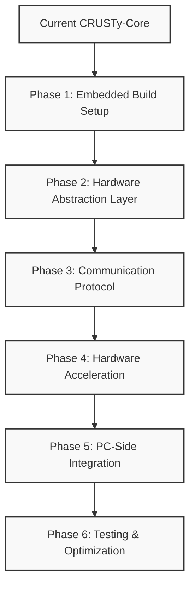

# CRUSTy-Core STM32H573I-DK Migration Development Guide

## Overview

This document serves as a comprehensive guide for migrating CRUSTy-Core to the STM32H573I-DK microcontroller and implementing encryption services from the embedded system. Rather than providing complete code implementations, this guide focuses on the development process, key considerations, and effective prompts for instructing the development of each feature.

## Current System Analysis

CRUSTy-Core currently has:

1. **Hybrid Architecture**:

   - Rust for input handling and memory-safe operations
   - C++ for cryptographic core and file operations
   - Well-defined FFI boundary between languages

2. **Cryptographic Implementation**:

   - AES-256-GCM encryption via Rust's `aes-gcm` crate
   - Argon2id for password hashing and key derivation
   - Clean C++ wrapper around Rust crypto functions

3. **Missing Components for Embedded Target**:
   - STM32H573I-DK hardware abstraction layer
   - Communication protocol between PC and embedded device
   - Hardware acceleration integration
   - Embedded-specific build configuration

## Migration Strategy



## Phase 1: Embedded Build Setup

### 1.1 ARM Toolchain Configuration

**Description:**
We need to create a CMake toolchain file for the STM32H573I-DK target. This file will define the cross-compiler settings, CPU flags, and other configuration needed for building the embedded firmware.

**Development Prompt:**

```
I need to create a CMake toolchain file for the STM32H573I-DK target. This file should:
1. Set the system name to Generic and processor to ARM
2. Specify arm-none-eabi-gcc as the cross compiler
3. Set appropriate CPU flags for Cortex-M33 (-mcpu=cortex-m33 -mthumb -mfloat-abi=hard -mfpu=fpv5-sp-d16)
4. Configure compiler flags for embedded development (function sections, data sections, no exceptions)
5. Set up linker flags for embedded target
6. Configure the root filesystem for cross-compilation

Please create this file as cmake/arm-none-eabi.cmake
```

**Unit Test Prompt:**

```
I need to test if our ARM toolchain configuration works correctly. Please:
1. Create a simple test CMake project that uses our arm-none-eabi.cmake toolchain file
2. Add a basic "Hello World" C++ file that would compile for the STM32H573I-DK
3. Configure the project with the toolchain file
4. Build the project and verify it compiles without errors
5. Check that the output is an ELF file suitable for the ARM Cortex-M33 target
```

### 1.2 Rust Configuration for Embedded Target

**Description:**
We need to update the Rust crypto library's configuration to support the ARM Cortex-M33 target. This involves modifying the Cargo.toml file to add appropriate features and dependencies for embedded development.

**Development Prompt:**

```
I need to update our Rust crypto library to support the STM32H573I-DK's ARM Cortex-M33 processor. Please modify rust/crypto/Cargo.toml to:
1. Add feature flags for conditional compilation (std vs embedded)
2. Configure dependencies to work without the standard library when needed
3. Add embedded-specific dependencies like cortex-m, cortex-m-rt, and stm32h5
4. Ensure the crate can be compiled for both PC and embedded targets
5. Keep the existing staticlib and rlib crate types
```

**Unit Test Prompt:**

```
I need to test if our Rust configuration for the embedded target works correctly. Please:
1. Create a simple test that checks if the Rust crypto library compiles for the ARM target
2. Use the command: cargo build --target thumbv7em-none-eabihf --features embedded --no-default-features
3. Verify that the compilation succeeds and produces a static library
4. Check that the library doesn't depend on the Rust standard library
```

### 1.3 CMake Configuration for Embedded Target

**Description:**
We need to update the main CMakeLists.txt file to support building for the STM32H573I-DK target. This involves adding options for the embedded target, configuring the STM32CubeH5 HAL, and setting up the embedded firmware target.

**Development Prompt:**

```
I need to update our CMakeLists.txt to support building for the STM32H573I-DK target. Please:
1. Add an option for building the embedded target (BUILD_EMBEDDED_TARGET)
2. Configure the STM32CubeH5 HAL library when building for embedded
3. Add appropriate definitions for the embedded target (-DEMBEDDED_TARGET, -DSTM32H573xx, -DNO_QT_UI)
4. Set up Rust flags for the embedded target
5. Create an embedded firmware target (crusty_embedded)
6. Add a post-build command to generate a binary file for flashing
```

**Unit Test Prompt:**

```
I need to test if our CMake configuration for the embedded target works correctly. Please:
1. Configure the project with -DBUILD_EMBEDDED_TARGET=ON -DCMAKE_TOOLCHAIN_FILE=cmake/arm-none-eabi.cmake
2. Build the project and verify it compiles without errors
3. Check that the crusty_embedded target is created
4. Verify that the post-build command generates a binary file
5. Examine the binary file to ensure it's suitable for flashing to the STM32H573I-DK
```

### 1.4 CMake Preset for Embedded Target

**Description:**
We need to add a new preset to CMakePresets.json for the STM32H573I-DK target. This will make it easier to configure the project for embedded development.

**Development Prompt:**

```
I need to add a new preset to CMakePresets.json for the STM32H573I-DK target. Please:
1. Create a preset named "stm32h573i-dk"
2. Set the generator to "Ninja"
3. Configure it to use our ARM toolchain file
4. Enable the BUILD_EMBEDDED_TARGET option
5. Disable the USE_QT option
6. Set the build type to "Release"
```

**Unit Test Prompt:**

```
I need to test if our CMake preset for the embedded target works correctly. Please:
1. Use the command: cmake --preset stm32h573i-dk
2. Verify that the configuration succeeds without errors
3. Check that the correct options are set (BUILD_EMBEDDED_TARGET=ON, USE_QT=OFF)
4. Verify that the ARM toolchain is being used
5. Build the project with the preset and check for successful compilation
```

## Phase 2: Hardware Abstraction Layer

### 2.1 Embedded Main Entry Point

**Description:**
We need to create the main entry point for the embedded firmware. This will initialize the hardware, set up the communication protocol, and implement the main processing loop.

**Development Prompt:**

```
I need to create the main entry point for our STM32H573I-DK firmware. Please create src/cpp/embedded_main.cpp that:
1. Includes necessary headers for the STM32H5 HAL, our encryptor, and communication protocol
2. Initializes the hardware (HAL_Init, SystemClock_Config)
3. Sets up our hardware abstraction layer
4. Initializes the communication protocol
5. Creates an encryptor instance
6. Implements a main processing loop that:
   - Checks for incoming commands
   - Processes commands (encrypt, decrypt, key generation)
   - Sends responses
   - Optionally enters low-power mode when idle
```

**Unit Test Prompt:**

```
I need to test our embedded main entry point. Please:
1. Create a mock implementation of the hardware abstraction layer and communication protocol
2. Write a unit test that verifies:
   - Hardware initialization is called
   - Communication protocol is initialized
   - The main loop processes commands correctly
   - Responses are sent for each command type
3. Use a test framework like Catch2 or Google Test
4. Ensure the test can run on the development PC (not requiring actual hardware)
```

### 2.2 Hardware Abstraction Layer

**Description:**
We need to create a hardware abstraction layer for the STM32H573I-DK. This will provide a clean interface for initializing hardware, using hardware acceleration, managing power, and configuring memory protection.

**Development Prompt:**

```
I need to create a hardware abstraction layer for the STM32H573I-DK. Please:
1. Create src/cpp/embedded/hardware_init.h that defines:
   - Hardware initialization functions
   - Hardware crypto acceleration functions (AES-GCM, SHA, RNG)
   - Power management functions
   - Memory protection configuration
   - Secure boot verification
2. Create src/cpp/embedded/hardware_init.cpp that implements these functions using the STM32H5 HAL
3. Focus on the AES-GCM hardware acceleration, as this is critical for our encryption service
4. Implement memory protection to isolate sensitive operations
5. Include proper error handling and status reporting
```

**Unit Test Prompt:**

```
I need to test our hardware abstraction layer. Please:
1. Create unit tests for each major component:
   - Hardware initialization
   - AES-GCM hardware acceleration
   - SHA hardware acceleration
   - Random number generation
   - Memory protection
2. Use mock implementations of the STM32H5 HAL functions
3. Verify that each function calls the appropriate HAL functions with correct parameters
4. Test error handling by simulating HAL function failures
5. Ensure the tests can run on the development PC
```

### 2.3 Memory Protection Configuration

**Description:**
We need to implement memory protection for the STM32H573I-DK to isolate sensitive operations and protect against attacks. This will use the Memory Protection Unit (MPU) to define secure regions.

**Development Prompt:**

```
I need to implement memory protection for the STM32H573I-DK using the MPU. Please:
1. Create a function to configure the MPU with secure regions for:
   - Cryptographic keys and sensitive data (read/write only by privileged code)
   - Code execution regions (execute-only)
   - Peripheral regions (privileged access only)
2. Implement proper error handling
3. Add documentation explaining the security benefits of each configuration
4. Ensure the configuration is applied early in the boot process
```

**Unit Test Prompt:**

```
I need to test our memory protection configuration. Please:
1. Create a unit test that verifies:
   - MPU is disabled before configuration
   - Correct regions are configured with appropriate permissions
   - MPU is enabled after configuration
2. Mock the MPU configuration functions
3. Verify that the correct parameters are passed to the HAL functions
4. Test error handling by simulating HAL function failures
```

## Phase 3: Communication Protocol

### 3.1 Communication Protocol Definition

**Description:**
We need to define a communication protocol between the PC and the STM32H573I-DK. This protocol will handle command and response messages for encryption operations.

**Development Prompt:**

```
I need to define a communication protocol between the PC and the STM32H573I-DK. Please create src/cpp/embedded/comm_protocol.h that:
1. Defines command types (Encrypt, Decrypt, KeyGen, Status, Reset)
2. Defines error codes (Success, InvalidCommand, AuthenticationFailed, etc.)
3. Defines structures for commands and responses
4. Creates a Protocol class with methods for:
   - Initializing communication
   - Checking for available commands
   - Receiving commands
   - Sending responses
   - Sending error responses
5. Includes constants for message format (magic numbers, type codes, etc.)
```

**Unit Test Prompt:**

```
I need to test our communication protocol definition. Please:
1. Create unit tests that verify:
   - Command and response structures have the expected layout
   - Protocol class methods have the correct signatures
   - Constants have the expected values
2. These should be compile-time tests that ensure the protocol definition is correct
3. No runtime functionality needs to be tested at this stage
```

### 3.2 Communication Protocol Implementation

**Description:**
We need to implement the communication protocol for the STM32H573I-DK. This will handle UART communication, message formatting, and error handling.

**Development Prompt:**

```
I need to implement the communication protocol for the STM32H573I-DK. Please create src/cpp/embedded/comm_protocol.cpp that:
1. Implements the Protocol class methods defined in comm_protocol.h
2. Uses UART for communication (USART1 on the STM32H573I-DK)
3. Handles message formatting according to our protocol:
   - 2 bytes magic number
   - 1 byte message type
   - 4 bytes length
   - 4 bytes command ID
   - Variable-length payload
   - 2 bytes CRC
4. Implements proper error handling and timeout management
5. Includes CRC calculation for message validation
```

**Unit Test Prompt:**

```
I need to test our communication protocol implementation. Please:
1. Create unit tests that verify:
   - Protocol initialization configures UART correctly
   - Command reception parses messages correctly
   - Response sending formats messages correctly
   - CRC calculation works as expected
   - Error handling works for various failure scenarios
2. Mock the UART functions to simulate communication
3. Test with various message types and payloads
4. Verify that malformed messages are rejected
```

### 3.3 Command Handlers

**Description:**
We need to implement handlers for the various commands supported by our protocol. These will process encryption, decryption, and key generation commands.

**Development Prompt:**

```
I need to implement command handlers for our communication protocol. Please:
1. Create src/cpp/embedded/command_handlers.h and command_handlers.cpp
2. Implement handlers for:
   - Encrypt command (processEncryptCommand)
   - Decrypt command (processDecryptCommand)
   - Key generation command (processKeyGenCommand)
3. Each handler should:
   - Validate the command data
   - Extract parameters (data, password, etc.)
   - Perform the requested operation using our encryptor
   - Format and send a response
   - Handle errors appropriately
4. Include proper error handling and status reporting
```

**Unit Test Prompt:**

```
I need to test our command handlers. Please:
1. Create unit tests that verify:
   - Each handler correctly validates command data
   - Parameters are extracted correctly
   - Operations are performed with the correct parameters
   - Responses are formatted correctly
   - Errors are handled appropriately
2. Mock the encryptor and protocol to isolate the handlers
3. Test with various input data and error conditions
4. Verify that malformed commands are rejected
```

## Phase 4: Hardware Acceleration

### 4.1 Rust Crypto Library Adaptation

**Description:**
We need to adapt our Rust crypto library to support hardware acceleration on the STM32H573I-DK. This involves adding conditional compilation for embedded targets and FFI functions for hardware acceleration.

**Development Prompt:**

```
I need to adapt our Rust crypto library to support hardware acceleration on the STM32H573I-DK. Please modify rust/crypto/src/lib.rs to:
1. Add conditional compilation for embedded targets (#[cfg(feature = "embedded")])
2. Define FFI functions for hardware acceleration:
   - hw_aes_gcm_encrypt
   - hw_aes_gcm_decrypt
   - hw_random_bytes
3. Implement functions to use hardware acceleration when available:
   - encrypt_with_hardware
   - decrypt_with_hardware
   - get_random_bytes
4. Modify the existing encrypt_data and decrypt_data functions to:
   - Try hardware acceleration first (when available)
   - Fall back to software implementation if hardware acceleration fails
5. Ensure proper error handling and status reporting
```

**Unit Test Prompt:**

```
I need to test our Rust crypto library adaptation for hardware acceleration. Please:
1. Create unit tests that verify:
   - Conditional compilation works correctly
   - Hardware acceleration functions are called when available
   - Software fallback works when hardware acceleration fails
   - Error handling works correctly
2. Mock the hardware acceleration functions
3. Test with various input data and error conditions
4. Verify that the results are consistent between hardware and software implementations
```

### 4.2 C++ Hardware Acceleration Interface

**Description:**
We need to implement a C++ interface for the STM32H5's hardware cryptographic accelerators. This will provide functions for AES-GCM encryption/decryption and random number generation.

**Development Prompt:**

```
I need to implement a C++ interface for the STM32H5's hardware cryptographic accelerators. Please create src/cpp/embedded/hw_crypto.cpp that:
1. Implements the following C functions (to be called from Rust):
   - hw_aes_gcm_encrypt
   - hw_aes_gcm_decrypt
   - hw_random_bytes
2. Uses the STM32H5 HAL to access hardware accelerators:
   - CRYP peripheral for AES-GCM
   - RNG peripheral for random number generation
3. Handles parameter validation and error reporting
4. Includes proper cleanup of hardware resources
5. Optimizes for performance (e.g., using DMA where appropriate)
```

**Unit Test Prompt:**

```
I need to test our C++ hardware acceleration interface. Please:
1. Create unit tests that verify:
   - Hardware acceleration functions call the correct HAL functions
   - Parameters are validated correctly
   - Error handling works correctly
   - Resources are properly cleaned up
2. Mock the STM32H5 HAL functions
3. Test with various input data and error conditions
4. Verify that the interface works correctly with the Rust FFI
```

## Phase 5: PC-Side Integration

### 5.1 PC-Side Communication Interface

**Description:**
We need to create a PC-side interface for communicating with the STM32H573I-DK. This will allow the PC application to send encryption requests to the embedded device.

**Development Prompt:**

```
I need to create a PC-side interface for communicating with the STM32H573I-DK. Please create src/cpp/core/embedded_device.h that:
1. Defines an EmbeddedDevice class with methods for:
   - Connecting to the device
   - Disconnecting from the device
   - Checking connection status
   - Encrypting data using the device
   - Decrypting data using the device
   - Generating keys using the device
   - Getting device status
2. Includes private methods for:
   - Sending commands to the device
   - Receiving responses from the device
   - Handling errors
3. Defines constants for command IDs and error codes (matching the embedded side)
```

**Unit Test Prompt:**

```
I need to test our PC-side communication interface. Please:
1. Create unit tests that verify:
   - Connection and disconnection work correctly
   - Commands are formatted correctly
   - Responses are parsed correctly
   - Error handling works correctly
2. Mock the serial port to simulate communication
3. Test with various commands and responses
4. Verify that the interface correctly handles communication errors
```

### 5.2 Serial Communication Implementation

**Description:**
We need to implement serial communication for the PC side to communicate with the STM32H573I-DK. This will provide a cross-platform way to send and receive data over a serial port.

**Development Prompt:**

```
I need to implement serial communication for the PC side. Please create src/cpp/core/serial_port.h and serial_port.cpp that:
1. Define a SerialPort class with methods for:
   - Opening and closing the port
   - Checking if the port is open
   - Writing data to the port
   - Reading data from the port
   - Reading a specific number of bytes
   - Flushing the port buffers
2. Implement platform-specific code for Windows, Linux, and macOS
3. Handle timeouts and error conditions
4. Provide clear error reporting
```

**Unit Test Prompt:**

```
I need to test our serial communication implementation. Please:
1. Create unit tests that verify:
   - Port opening and closing work correctly
   - Data writing works correctly
   - Data reading works correctly
   - Timeout handling works correctly
   - Error handling works correctly
2. Mock the platform-specific serial port functions
3. Test on different platforms (Windows, Linux, macOS)
4. Verify that the implementation works with various baud rates and settings
```

### 5.3 Encryptor Modification for Embedded Device

**Description:**
We need to modify our Encryptor class to support using the embedded device for encryption operations. This will allow the PC application to offload encryption to the STM32H573I-DK.

**Development Prompt:**

```
I need to modify our Encryptor class to support using the embedded device for encryption. Please update src/cpp/core/encryptor.h and encryptor.cpp to:
1. Add an EncryptionMode enum (Local, Embedded)
2. Add methods for:
   - Setting the encryption mode
   - Setting the embedded device port
   - Getting the current encryption mode
   - Checking if the embedded device is connected
3. Add private members for:
   - Current encryption mode
   - Embedded device instance
4. Modify the encrypt and decrypt methods to:
   - Use the embedded device when in Embedded mode
   - Fall back to local encryption if the embedded device fails
   - Use local encryption when in Local mode
5. Include proper error handling and logging
```

**Unit Test Prompt:**

```
I need to test our Encryptor modifications for embedded device support. Please:
1. Create unit tests that verify:
   - Encryption mode can be set and retrieved
   - Embedded device connection works correctly
   - Encryption uses the embedded device when in Embedded mode
   - Encryption falls back to local when the embedded device fails
   - Encryption uses local when in Local mode
2. Mock the embedded device to simulate communication
3. Test with various data and error conditions
4. Verify that the results are consistent between local and embedded encryption
```

## Phase 6: Testing & Optimization

### 6.1 Integration Testing

**Description:**
We need to create integration tests to verify that the PC and embedded components work together correctly. These tests will ensure that encryption requests from the PC are properly processed by the STM32H573I-DK.

**Development Prompt:**

```
I need to create integration tests for our PC and embedded components. Please:
1. Create tests that verify:
   - PC can connect to the embedded device
   - PC can send encryption requests to the device
   - Device correctly processes the requests
   - PC correctly receives and processes the responses
2. Include tests for various data sizes and types
3. Test error conditions and recovery
4. Verify that the results match the expected output
```

**Unit Test Prompt:**

```
I need to run integration tests for our PC and embedded components. Please:
1. Connect an STM32H573I-DK to the development PC
2. Flash the embedded firmware to the device
3. Run the integration tests
4. Verify that all tests pass
5. Check for any performance issues or bottlenecks
```

### 6.2 Performance Optimization

**Description:**
We need to optimize the performance of our encryption service, focusing on throughput, latency, and power consumption. This will ensure that the STM32H573I-DK provides efficient encryption services.

**Development Prompt:**

```
I need to optimize the performance of our encryption service. Please:
1. Profile the current implementation to identify bottlenecks
2. Optimize the communication protocol for efficiency
3. Maximize the use of hardware acceleration
4. Implement DMA for data transfer where appropriate
5. Optimize power consumption during idle periods
6. Measure and report performance improvements
```

**Unit Test Prompt:**

```
I need to test the performance of our optimized encryption service. Please:
1. Create benchmarks for:
   - Encryption throughput (bytes per second)
   - Encryption latency (time to encrypt a fixed-size block)
   - Power consumption during active and idle periods
2. Compare performance before and after optimization
3. Test with various data sizes (small, medium, large)
4. Verify that optimizations don't affect correctness
```

### 6.3 Security Validation

**Description:**
We need to validate the security of our encryption service, focusing on key management, side-channel protection, and secure communication. This will ensure that the STM32H573I-DK provides secure encryption services.

**Development Prompt:**

```
I need to validate the security of our encryption service. Please:
1. Review the implementation for security vulnerabilities
2. Verify that keys are properly protected in memory
3. Check for side-channel vulnerabilities
4. Ensure that the communication protocol is secure
5. Verify that error handling doesn't leak sensitive information
6. Implement any necessary security improvements
```

**Unit Test Prompt:**

```
I need to test the security of our encryption service. Please:
1. Create security tests that verify:
   - Keys are not exposed in memory dumps
   - Side-channel attacks are mitigated
   - Communication is protected against replay and tampering
   - Error handling doesn't leak sensitive information
2. Attempt to exploit potential vulnerabilities
3. Verify that security measures are effective
```

## Conclusion

This development guide provides a comprehensive approach to migrating CRUSTy-Core to the STM32H573I-DK microcontroller and implementing encryption services from the embedded system. By following this guide and using the provided prompts, you can develop each component of the system in a structured and testable way.

The key benefits of this approach include:

1. **Maintains Architectural Integrity**: Preserves the core design philosophy of using Rust for input handling and C++ for cryptographic operations.

2. **Hardware Acceleration**: Leverages the STM32H5's hardware cryptographic accelerators for improved performance.

3. **Secure Communication**: Implements a robust communication protocol between PC and embedded device.

4. **Fallback Mechanisms**: Provides software fallbacks when hardware acceleration is unavailable.

5. **Comprehensive Testing**: Includes unit tests for validating functionality and performance at each step.

When you're ready to begin development, use the provided prompts to guide the implementation of each component.
