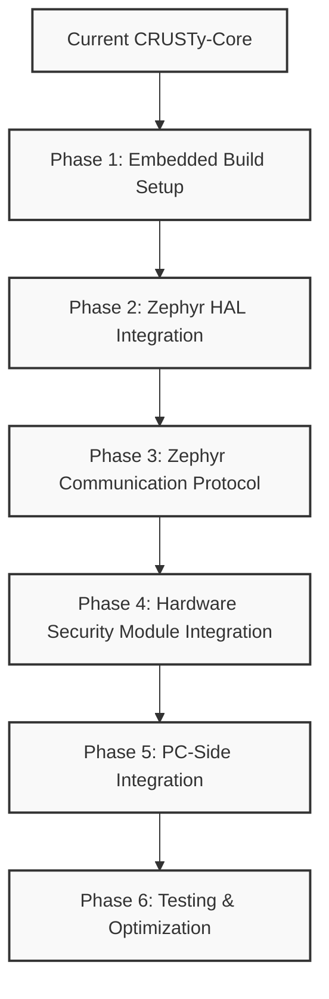

# CRUSTy-Core STM32H573I-DK Migration Development Guide

## Overview

This document serves as a comprehensive guide for migrating CRUSTy-Core to the STM32H573I-DK microcontroller and implementing encryption services from the embedded system using Zephyr RTOS. Rather than providing complete code implementations, this guide focuses on the development process, key considerations, and effective prompts for instructing the development of each feature.

## Current System Analysis

CRUSTy-Core currently has:

1. **Hybrid Architecture**:

   - Rust for input handling and memory-safe operations
   - C++ for cryptographic core and file operations
   - Well-defined FFI boundary between languages

2. **Cryptographic Implementation**:

   - AES-256-GCM encryption via Rust's `aes-gcm` crate
   - Argon2id for password hashing and key derivation
   - Clean C++ wrapper around Rust crypto functions

3. **Missing Components for Embedded Target**:
   - STM32H573I-DK hardware abstraction layer integration with Zephyr
   - Communication protocol between PC and embedded device
   - Hardware security module (HSM) integration
   - Embedded-specific build configuration

## Migration Strategy



## Progress Tracking

- ✅ = Completed
- ⏳ = In Progress
- ⬜ = Not Started

## Development Best Practices

### Continuous Codebase Cleanup and Organization ⏳

**Description:**
Instead of leaving cleanup as a final step, we should continuously maintain code organization throughout the development process. After completing each functional component, a cleanup step should be performed to:

1. Consolidate test and troubleshooting scripts
2. Remove redundant or deprecated files
3. Organize configuration files into appropriate directories
4. Document the purpose of retained scripts and configurations
5. Establish consistent naming conventions
6. Ensure code follows project style guidelines

This iterative approach will prevent accumulation of temporary files and maintain a clean, manageable codebase throughout development.

**Implementation:**

- After each completed feature, review the directory structure for temporary scripts
- Identify redundant build scripts and merge into canonical versions
- Document the purpose of each retained script in a header comment
- Create a "deprecated" or "archive" directory for potentially useful but non-essential scripts
- Maintain a clear separation between production and development/testing code

## Phase 1: Embedded Build Setup

### 1.1 Zephyr West Build System Integration ✅

**Description:**
We need to integrate the Zephyr West build system for the STM32H573I-DK target. This will set up the necessary build environment for Zephyr-based development.

**Development Prompt:**

```
I need to integrate the Zephyr West build system for our STM32H573I-DK target. Please:
1. Create a west.yml manifest file that includes the necessary Zephyr modules
2. Set up the project structure following Zephyr conventions
3. Configure the application as a Zephyr application
4. Set up the necessary board configuration files
5. Create a script to initialize the Zephyr workspace

Please create the necessary files in the tools/Zephyr directory.
```

**Testing Prompts:**

```
I need to test the basic Zephyr west build system integration. Please:
1. Initialize the Zephyr workspace using west init
2. Update the workspace using west update
3. Verify that all required modules are downloaded
4. Check that the workspace structure is correct
5. Verify that the STM32H573I-DK board is recognized by west
```

```
I need to test building a minimal Zephyr application for the STM32H573I-DK. Please:
1. Create a minimal Zephyr application with a simple main.c
2. Build the application using west build -b stm32h573i_dk
3. Verify that the build succeeds without errors
4. Check that the output files (ELF, BIN, HEX) are created
5. Verify that the binary is suitable for the STM32H573I-DK
```

```
I need to test the Zephyr configuration for our specific needs. Please:
1. Create a custom prj.conf with our required Zephyr features
2. Build the application with the custom configuration
3. Verify that the build includes all required features
4. Check that conditional compilation works correctly
5. Verify that the binary size is reasonable for our target
```

### 1.2 Rust Configuration for Zephyr Integration ✅

**Description:**
We need to update the Rust crypto library's configuration to support integration with Zephyr on the STM32H573I-DK. This involves modifying the Cargo.toml file to add appropriate features and dependencies for Zephyr-based embedded development.

**Development Prompt:**

```
I need to update our Rust crypto library to support integration with Zephyr on the STM32H573I-DK. Please modify rust/crypto/Cargo.toml to:
1. Add feature flags for conditional compilation (std vs zephyr_embedded)
2. Configure dependencies to work without the standard library when needed
3. Add embedded-specific dependencies compatible with Zephyr
4. Ensure the crate can be compiled for both PC and Zephyr-based embedded targets
5. Keep the existing staticlib and rlib crate types
6. Add build script modifications to detect Zephyr environment
```

**Testing Prompts:**

```
I need to test if our Rust configuration for Zephyr integration compiles correctly. Please:
1. Create a simple test that checks if the Rust crypto library compiles with the zephyr_embedded feature
2. Use the command: cargo build --target thumbv7em-none-eabihf --features zephyr_embedded --no-default-features
3. Verify that the compilation succeeds and produces a static library
4. Check that the library doesn't depend on the Rust standard library
```

```
I need to test the Rust FFI boundary with Zephyr. Please:
1. Create a simple C header from our Rust library using cbindgen
2. Verify that the generated header is compatible with Zephyr's C environment
3. Create a minimal C file that includes the header and calls a simple function
4. Compile the C file with Zephyr's toolchain
5. Verify that the linking works correctly
```

```
I need to test the Rust library's conditional compilation for Zephyr. Please:
1. Create a test file that uses different implementations based on the zephyr_embedded feature
2. Compile the library with and without the feature
3. Verify that the correct code paths are included in each build
4. Check that the no_std environment is properly supported
5. Verify that any Zephyr-specific adaptations are correctly applied
```

### 1.3 CMake Configuration for Zephyr Integration ✅

**Description:**
We need to update the main CMakeLists.txt file to support building with Zephyr for the STM32H573I-DK target. This involves integrating with Zephyr's CMake system and setting up the application structure.

**Development Prompt:**

```
I need to update our CMakeLists.txt to support building with Zephyr for the STM32H573I-DK target. Please:
1. Create a Zephyr-compatible CMakeLists.txt that includes the Zephyr package
2. Configure the application as a Zephyr application
3. Add appropriate definitions for the Zephyr target
4. Set up Rust integration with Zephyr using Corrosion
5. Create a Zephyr application target
6. Configure the necessary Zephyr modules and libraries
```

**Testing Prompts:**

```
I need to test if our CMake configuration for Zephyr integration works correctly. Please:
1. Configure the project using west build -b stm32h573i_dk
2. Verify that the configuration succeeds without errors
3. Check that the Zephyr package is correctly included
4. Verify that the Rust library is correctly integrated
5. Check that all required definitions are set
```

```
I need to test building our application with Zephyr. Please:
1. Build the project using west build
2. Verify that the build succeeds without errors
3. Check that the output files are created in the correct location
4. Verify that the binary includes both our code and Zephyr
5. Check that the binary size is reasonable for our target
```

```
I need to test the Zephyr application configuration. Please:
1. Examine the generated build files to verify Zephyr integration
2. Check that the correct Zephyr modules are included
3. Verify that our application is correctly configured as a Zephyr application
4. Test that conditional compilation works correctly
5. Verify that the build system correctly handles dependencies
```

### 1.4 Zephyr Device Tree Configuration ✅

**Description:**
We need to configure the Zephyr device tree for the STM32H573I-DK to properly define hardware resources, especially focusing on the hardware security module components.

**Important Note:**
During implementation, we discovered several hardware nodes referenced in the initial overlay were not defined in the base devicetree for STM32H573I-DK. Specifically:

- The `hash` (SHA hardware accelerator) node was undefined
- The `pka` (Public Key Accelerator) node was undefined
- Some crypto-related peripheral configurations needed adjustments
  This suggests that not all hardware security features in the reference manual may be available or accessible in the current Zephyr devicetree configuration for this board.

**Development Prompt:**

```
I need to configure the Zephyr device tree for the STM32H573I-DK with a focus on hardware security features. Please:
1. Create a device tree overlay file (.overlay) for our application
2. Configure only the cryptographic hardware accelerators that are available in the base devicetree (verify AES, RNG availability)
3. Set up the necessary clocks and power domains for confirmed peripherals
4. Configure DMA channels for efficient crypto operations if available
5. Define memory regions for secure operations
6. Set up UART for communication with the PC
7. Carefully check which hardware nodes are actually defined in the base devicetree before referencing them
```

**Testing Prompts:**

```
I need to test if our device tree configuration is correct. Please:
1. Build the application with the device tree overlay
2. Use west build -- -t devicetree_info to generate device tree information
3. Verify that all referenced nodes exist in the base devicetree
4. Check that available cryptographic accelerators are correctly configured
5. Verify that the memory regions are properly defined
```

```
I need to test the hardware resource allocation in our device tree. Please:
1. Examine the generated device tree to verify resource allocation
2. Check for any conflicts in hardware resources
3. Verify that interrupt priorities are correctly assigned
4. Check that DMA channels are properly allocated if available
5. Verify that clock configurations are correct for crypto operations
```

```
I need to test the device tree bindings for cryptographic hardware. Please:
1. Verify that the correct bindings are used for each available crypto peripheral
2. Check that all required properties are defined
3. Verify that optional properties are correctly configured
4. Test that the device tree compiler processes our overlay without warnings
5. Verify that the generated code correctly accesses the hardware
```

### 2.5 Hardware Security Feature Verification ✅

**Description:**
Before implementing crypto subsystem integration, we need to thoroughly verify which hardware security features are actually available on the STM32H573I-DK board and properly documented in the Zephyr devicetree.

**Development Prompt:**

```
I need to verify which hardware security features are available on the STM32H573I-DK board. Please:
1. Review the STM32H573I reference manual and datasheet to identify all security features
2. Cross-reference with the Zephyr devicetree to confirm which features have devicetree bindings
3. Create a detailed mapping document between hardware features and devicetree nodes
4. Test each hardware feature with a minimal example to confirm it works
5. Document fallback options for unavailable hardware acceleration
6. Update the devicetree overlay to only include verified working features

Please create this documentation in Documentation/Embedded/STM32H573I_Security_Features.md
```

**Testing Prompts:**

```
I need to test which hardware security features are accessible. Please:
1. Create minimal test applications for each crypto feature (AES, SHA, PKA, RNG)
2. Verify hardware acceleration is actually used (through profiling or debug logs)
3. Document any features that fall back to software implementation
4. Create a compatibility matrix showing which features are hardware vs. software
5. Test the performance difference between hardware and software implementations
```

## Phase 2: Zephyr HAL Integration

### 2.1 Zephyr HAL GPIO Integration ✅

**Zephyr Module Check:**
Before implementing any custom GPIO functionality, search Zephyr documentation and codebase for existing GPIO modules, drivers, and samples. Look for GPIO device drivers for STM32 family, LED and button control examples, and any ready-to-use abstractions. If suitable modules exist, leverage them directly rather than creating custom implementations.

**Description:**
We need to integrate with Zephyr's GPIO HAL for the STM32H573I-DK to control LEDs and read button inputs, which will be used for status indication and basic user interaction.

**Development Prompt:**

```
I need to integrate our application with Zephyr's GPIO HAL for the STM32H573I-DK. Please:
1. Create a module that uses Zephyr's device API to access GPIO devices
2. Implement functions to initialize GPIO pins for LEDs and buttons
3. Create wrapper functions for LED control that use Zephyr's GPIO API
4. Implement button input handling with Zephyr's GPIO callback system
5. Add proper error handling and status reporting
6. Create a simple demo that shows LED control and button input

Please implement this in src/gpio_control.c and gpio_control.h
```

**Testing Prompts:**

```
I need to test the basic GPIO initialization. Please:
1. Create a simple test that verifies GPIO devices are properly bound
2. Verify that LED pins are configured as outputs
3. Verify that button pins are configured as inputs with pull-up/pull-down
4. Test error handling when a device is not found
5. Check that initialization succeeds on both QEMU and real hardware
```

```
I need to test LED control functionality. Please:
1. Create a test that toggles each LED on and off
2. Verify that the LED state changes correctly
3. Test LED blinking at different frequencies
4. Verify that multiple LEDs can be controlled independently
5. Test error handling for invalid LED operations
```

```
I need to test button input handling. Please:
1. Create a test that detects button press and release events
2. Verify that callbacks are triggered correctly
3. Test debouncing functionality
4. Verify that multiple buttons can be monitored simultaneously
5. Test that button events correctly trigger LED state changes in the demo
```

### 2.2 Zephyr HAL UART Integration ✅

**Zephyr Module Check:**
Before implementing custom UART functionality, search Zephyr documentation and codebase for existing UART modules, drivers, and samples for STM32 family. Look for UART device drivers, communication protocols, buffering systems, and interrupt handling implementations. If suitable modules exist, leverage them directly rather than creating custom implementations.

**Description:**
We need to integrate with Zephyr's UART HAL for the STM32H573I-DK to establish communication with the PC for sending and receiving encryption commands and data.

**Development Prompt:**

```
I need to integrate our application with Zephyr's UART HAL for the STM32H573I-DK. Please:
1. Create a module that uses Zephyr's device API to access UART devices
2. Implement functions to initialize UART with appropriate settings (baud rate, data bits, etc.)
3. Create functions for sending and receiving data over UART
4. Implement interrupt-driven UART reception with a callback system
5. Add proper error handling and timeout management
6. Create a simple echo demo that receives data and sends it back

Please implement this in src/uart_comm.c and uart_comm.h
```

**Testing Prompts:**

```
I need to test the basic UART initialization. Please:
1. Create a test that verifies the UART device is properly bound
2. Verify that UART is configured with the correct settings
3. Test error handling when the device is not found
4. Check that initialization succeeds on both QEMU and real hardware
5. Verify that the UART interrupt is properly configured
```

```
I need to test UART transmission functionality. Please:
1. Create a test that sends various data patterns over UART
2. Verify that data is correctly transmitted
3. Test sending different data sizes
4. Verify that transmission works at different baud rates
5. Test error handling for transmission failures
```

```
I need to test UART reception functionality. Please:
1. Create a test that receives data over UART
2. Verify that received data matches what was sent
3. Test receiving different data sizes
4. Verify that the callback system works correctly
5. Test that the echo demo correctly echoes received data
```

### 2.3 Zephyr Crypto Subsystem Integration ✅

**Zephyr Module Check:**
Before implementing custom crypto functionality, search Zephyr documentation and codebase for existing crypto subsystem implementations specific to STM32 family. Look for hardware-accelerated encryption modules, crypto drivers, and security samples. Search specifically for AES-GCM, SHA, and RNG implementations that leverage STM32 hardware security features. If suitable modules exist, leverage them directly rather than creating custom implementations.

**Description:**
We need to integrate with Zephyr's crypto subsystem to access the STM32H573I-DK's hardware security module features, including AES-GCM encryption, SHA hashing, and random number generation.

**Development Prompt:**

```
I need to integrate our application with Zephyr's crypto subsystem for the STM32H573I-DK. Please:
1. Create a module that uses Zephyr's crypto API to access hardware security features
2. Implement functions for AES-GCM encryption and decryption
3. Create functions for SHA-256 hashing
4. Implement secure random number generation
5. Add proper error handling and status reporting
6. Create a simple demo that showcases each crypto operation

Please implement this in src/crypto_ops.c and crypto_ops.h
```

**Testing Prompts:**

```
I need to test the basic crypto subsystem initialization. Please:
1. Create a test that verifies the crypto devices are properly bound
2. Verify that the crypto subsystem is initialized with correct settings
3. Test error handling when devices are not found
4. Check that initialization succeeds on both QEMU and real hardware
5. Verify that the crypto hardware is properly configured
```

```
I need to test AES-GCM encryption and decryption. Please:
1. Create a test that encrypts and decrypts various data patterns
2. Verify that decrypted data matches the original plaintext
3. Test with different key sizes and data sizes
4. Verify that authentication tags are correctly generated and verified
5. Test error handling for encryption/decryption failures
```

```
I need to test SHA-256 hashing. Please:
1. Create a test that generates hashes for various inputs
2. Verify that the hashes match expected values
3. Test with different input sizes
4. Verify that incremental hashing works correctly
5. Test error handling for hashing failures
```

```
I need to test random number generation. Please:
1. Create a test that generates random numbers
2. Verify that the numbers have sufficient entropy
3. Test generating different amounts of random data
4. Verify that the random number generator doesn't produce predictable patterns
5. Test error handling for RNG failures
```

### 2.4 Zephyr Memory Protection Integration ✅

**Zephyr Module Check:**
Before implementing custom memory protection functionality, search Zephyr documentation and codebase for existing memory protection features and MPU drivers specifically for STM32 family. Look for security partitioning examples, memory domain APIs, and security-focused samples. If suitable modules exist, leverage them directly rather than creating custom implementations.

**Description:**
We need to integrate with Zephyr's memory protection capabilities to secure sensitive operations and data on the STM32H573I-DK, leveraging the Memory Protection Unit (MPU).

**Development Prompt:**

```
I need to integrate our application with Zephyr's memory protection capabilities for the STM32H573I-DK. Please:
1. Create a module that configures Zephyr's memory protection
2. Define secure memory regions for cryptographic keys and sensitive data
3. Configure execute-only regions for code
4. Set up privileged-access-only regions for peripherals
5. Implement proper error handling
6. Create a simple demo that verifies memory protection is working

Please implement this in src/mem_protect.c and mem_protect.h
```

**Testing Prompts:**

```
I need to test the basic memory protection configuration. Please:
1. Create a test that verifies memory regions are correctly configured
2. Verify that the MPU is enabled
3. Test error handling during configuration
4. Check that configuration succeeds on both QEMU and real hardware
5. Verify that the memory protection settings match our security requirements
```

```
I need to test secure memory regions. Please:
1. Create a test that attempts to access secure memory from different privilege levels
2. Verify that unauthorized access is prevented
3. Test that authorized access works correctly
4. Verify that memory protection faults are correctly handled
5. Test that sensitive data is properly protected
```

```
I need to test execute-only regions. Please:
1. Create a test that attempts to read from execute-only regions
2. Verify that read access is prevented
3. Test that code execution from these regions works correctly
4. Verify that memory protection faults are correctly handled
5. Test that code integrity is maintained
```

### 2.5 Dual Platform HAL Implementation ✅

**Description:**
As we've built out QEMU simulation implementations, we need to refactor our code to support both QEMU and the physical STM32H573I-DK hardware in a dual-platform approach, ensuring a smooth transition to actual hardware.

**Development Prompt:**

```
I need to implement a dual-platform approach that supports both QEMU simulation and the physical STM32H573I-DK. Please:
1. Refactor our modules to use conditional compilation (#ifdef CONFIG_BOARD_QEMU_CORTEX_M3 / #else)
2. Implement hardware-specific versions of all crypto operations using STM32H5 peripherals (CRYP, HASH, RNG)
3. Create hardware-specific memory protection using the Cortex-M33 MPU and TrustZone
4. Update the device tree overlay with proper configurations for the physical board
5. Add proper build flags in prj.conf for conditional feature enabling
6. Ensure both platforms share the same API but use different implementations

Please update existing files with these changes, maintaining all current functionality.
```

**Implementation Details:**

- Refactored all HAL components (crypto_ops.c, gpio_control.c, uart_comm.c, mem_protect.c) to handle both platforms
- Used conditional compilation (#ifdef CONFIG_BOARD_QEMU_CORTEX_M3) to select platform-specific code
- Implemented hardware acceleration for AES-GCM and RNG on STM32H573I-DK
- Added software fallbacks for all functions when hardware isn't available
- Created automatic platform detection in CMakeLists.txt with appropriate conditional flags
- Updated prj.conf to handle both platforms with a single configuration file
- Created a dedicated build_stm32.ps1 script for hardware builds
- Ensured consistent API with platform-specific optimizations

**Testing Prompts:**

```
I need to test if our conditional compilation works correctly. Please:
1. Build the application for both QEMU and STM32H573I-DK targets
2. Verify that the correct implementations are selected for each platform
3. Check that the same API works on both platforms
4. Verify that build flags correctly influence the compilation process
5. Test that platform-specific optimizations are applied correctly
```

```
I need to test the STM32H573I-DK hardware implementations. Please:
1. Create a test that uses hardware accelerators for crypto operations
2. Verify that the hardware peripherals are correctly initialized and configured
3. Test performance against software implementations
4. Verify that hardware-specific features are properly utilized
5. Test error handling for hardware-specific failures
```

```
I need to test the seamless operation across platforms. Please:
1. Create a test application that can run unchanged on both platforms
2. Verify that the same code produces the expected results on both QEMU and hardware
3. Test edge cases that might differ between the platforms
4. Verify that error handling is consistent across platforms
5. Test that performance metrics are collected appropriately for each platform
```

## Phase 3: Zephyr Communication Protocol

### 3.1 Zephyr Shell Command Interface ✅

**Zephyr Module Check:**
Before implementing custom shell command functionality, search Zephyr documentation and codebase for existing shell subsystem implementations. Look for command registration APIs, argument parsing utilities, and crypto-related shell command examples. If suitable modules exist, leverage them directly rather than creating custom implementations.

**Description:**
We need to implement a Zephyr shell command interface for the STM32H573I-DK to provide a user-friendly way to interact with the encryption services.

**Development Prompt:**

```
I need to implement a Zephyr shell command interface for our encryption services. Please:
1. Create a module that registers shell commands with Zephyr's shell subsystem
2. Implement commands for encryption, decryption, key generation, and status
3. Create command handlers that parse arguments and call the appropriate functions
4. Add help text and usage information for each command
5. Implement proper error handling and user feedback
6. Create a simple demo that showcases the shell interface

Please implement this in src/shell_cmds.c and shell_cmds.h
```

**Testing Prompts:**

```
I need to test the shell command registration. Please:
1. Create a test that verifies commands are correctly registered
2. Verify that help text is available for each command
3. Test that command handlers are properly linked
4. Check that the shell subsystem is correctly initialized
5. Verify that commands are accessible through the shell
```

```
I need to test the encryption and decryption commands. Please:
1. Create a test that uses the shell to encrypt and decrypt data
2. Verify that the commands correctly parse arguments
3. Test with various input formats (hex, base64, raw)
4. Verify that error handling works for invalid inputs
5. Test that the commands provide appropriate feedback
```

```
I need to test the key generation and status commands. Please:
1. Create a test that uses the shell to generate keys and check status
2. Verify that the commands correctly parse arguments
3. Test key generation with different parameters
4. Verify that status information is accurate
5. Test that the commands provide appropriate feedback
```

### 3.2 Zephyr USB CDC ACM Implementation ⬜

**Zephyr Module Check:**
Before implementing custom USB functionality, search Zephyr documentation and codebase for existing USB CDC ACM implementations specific to STM32 family. Look for device drivers, communication protocols, and sample applications that demonstrate USB serial communication. If suitable modules exist, leverage them directly rather than creating custom implementations.

**Description:**
We need to implement USB CDC ACM communication for the STM32H573I-DK to provide a reliable, high-speed connection to the PC for encryption services.

**Development Prompt:**

```
I need to implement USB CDC ACM communication for our STM32H573I-DK. Please:
1. Create a module that initializes Zephyr's USB CDC ACM subsystem
2. Implement functions for sending and receiving data over USB
3. Create a callback system for handling received data
4. Add proper error handling and status reporting
5. Implement a simple protocol for encryption commands and responses
6. Create a demo that showcases USB communication

Please implement this in src/usb_comm.c and usb_comm.h
```

**Testing Prompts:**

```
I need to test the USB CDC ACM initialization. Please:
1. Create a test that verifies the USB device is properly configured
2. Verify that the CDC ACM interface is correctly set up
3. Test error handling during initialization
4. Check that initialization succeeds on real hardware
5. Verify that the device is detected by the host PC
```

```
I need to test USB data transmission. Please:
1. Create a test that sends various data patterns over USB
2. Verify that data is correctly transmitted
3. Test sending different data sizes
4. Verify that transmission works at different speeds
5. Test error handling for transmission failures
```

```
I need to test USB data reception. Please:
1. Create a test that receives data over USB
2. Verify that received data matches what was sent
3. Test receiving different data sizes
4. Verify that the callback system works correctly
5. Test that the protocol correctly handles commands and responses
```

### 3.3 Zephyr Bluetooth LE Service Implementation ⬜

**Zephyr Module Check:**
Before implementing custom Bluetooth LE functionality, search Zephyr documentation and codebase for existing BLE service implementations and samples. Look for GATT service definition utilities, security features, and STM32-compatible BLE stacks. Search for any crypto or security-related BLE service examples. If suitable modules exist, leverage them directly rather than creating custom implementations.

**Description:**
We need to implement a Bluetooth LE service for the STM32H573I-DK to provide wireless access to encryption services, which can be useful for mobile applications.

**Development Prompt:**

```
I need to implement a Bluetooth LE service for our encryption services. Please:
1. Create a module that initializes Zephyr's Bluetooth subsystem
2. Define a custom GATT service for encryption operations
3. Implement characteristics for encryption, decryption, and key generation
4. Create handlers for read, write, and notify operations
5. Add proper error handling and security measures
6. Create a demo that showcases the Bluetooth LE service

Please implement this in src/ble_service.c and ble_service.h
```

**Testing Prompts:**

```
I need to test the Bluetooth LE initialization. Please:
1. Create a test that verifies the Bluetooth subsystem is properly initialized
2. Verify that the GATT service is correctly registered
3. Test error handling during initialization
4. Check that initialization succeeds on real hardware
5. Verify that the device advertises correctly
```

```
I need to test the encryption and decryption characteristics. Please:
1. Create a test that uses a BLE client to write to and read from these characteristics
2. Verify that data is correctly encrypted and decrypted
3. Test with various data sizes (considering BLE packet limitations)
4. Verify that notifications work for long operations
5. Test error handling for invalid operations
```

```
I need to test the security features of our BLE service. Please:
1. Create a test that verifies pairing and bonding
2. Test encryption level requirements
3. Verify that unauthorized access is prevented
4. Test that sensitive operations require authentication
5. Verify that the service follows BLE security best practices
```

## Phase 4: Hardware Security Module Integration

### 4.1 Zephyr Crypto API for AES-GCM ⬜

**Zephyr Module Check:**
Before implementing custom AES-GCM functionality, search Zephyr documentation and codebase for existing hardware-accelerated AES-GCM implementations specific to STM32 family. Look for crypto API extensions, hardware acceleration drivers, and encryption samples that utilize STM32's security features. If suitable modules exist, leverage them directly rather than creating custom implementations.

**Description:**
We need to implement AES-GCM encryption and decryption using Zephyr's crypto API and the STM32H573I-DK's hardware accelerator.

**Development Prompt:**

```
I need to implement AES-GCM encryption and decryption using Zephyr's crypto API and the STM32H573I-DK's hardware accelerator. Please:
1. Create a module that uses Zephyr's crypto API for AES-GCM operations
2. Implement functions for key setup, encryption, and decryption
3. Configure the hardware accelerator for optimal performance
4. Add proper error handling and status reporting
5. Create a simple benchmark for measuring performance
6. Implement a demo that showcases AES-GCM encryption and decryption

Please implement this in src/aes_gcm.c and aes_gcm.h
```

**Testing Prompts:**

```
I need to test the basic AES-GCM functionality. Please:
1. Create a test that encrypts and decrypts various data patterns
2. Verify that decrypted data matches the original plain
```
