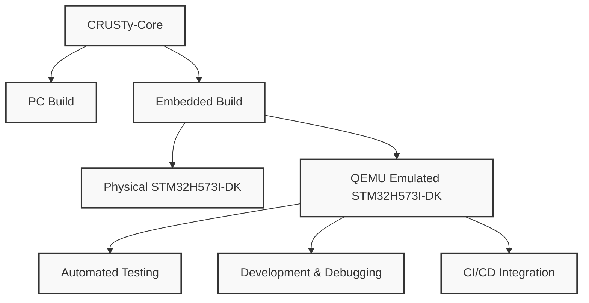
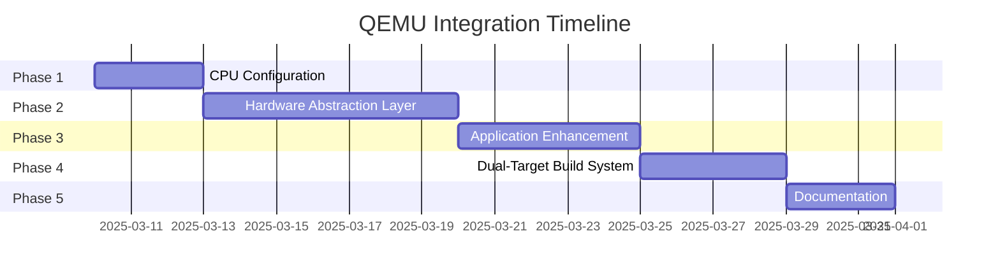

# QEMU Integration and Emulation for STM32H573I-DK

This comprehensive guide covers both the architectural integration of QEMU emulation for the STM32H573I-DK development kit and practical setup/usage instructions. This unified document combines the conceptual overview, implementation details, and practical usage instructions.

## Table of Contents

1. [Overview](#overview)
2. [Current Status](#current-status)
3. [Architecture](#architecture)
4. [Setup and Installation](#setup-and-installation)
5. [Using QEMU for STM32H573I-DK Emulation](#using-qemu-for-stm32h573i-dk-emulation)
6. [Development Workflow](#development-workflow)
7. [Debugging with GDB](#debugging-with-gdb)
8. [Known Limitations](#known-limitations)
9. [Implementation Plan](#implementation-plan)
10. [Troubleshooting](#troubleshooting)

## Overview

QEMU emulation for the STM32H573I-DK development kit enables development and testing of embedded code without physical hardware. This approach provides several benefits:

- Faster development cycles through rapid testing
- Automated testing in CI/CD pipelines
- Development without requiring physical hardware
- Easier debugging with enhanced tools
- Consistent testing environment



## Current Status

We've successfully configured Zephyr QEMU for emulating the STM32H573I-DK application. After encountering several challenges with CPU compatibility, we've implemented a working solution:

- Initially attempted to use the STM32H573I-DK board configuration with QEMU, but encountered issues with CPU_CORTEX_M7 and CPU_CORTEX_M33 configurations
- Discovered that the installed QEMU version has limited support for Cortex-M CPUs (only Cortex-M3 for mps2-an385 and Cortex-M7 for other machines)
- Changed approach to use the qemu_cortex_m3 board target, which is specifically designed for QEMU emulation
- Successfully built and ran the application in QEMU using this approach

The current configuration includes:

- A basic Zephyr application that can run in QEMU
- PowerShell script (run-qemu.ps1) for building and running the application
- Configuration to use the qemu_cortex_m3 board target with the mps2-an385 machine

After analyzing the current implementation, we've identified several areas for improvement and created a detailed plan to enhance the STM32H573I-DK QEMU emulation.

## Architecture

The QEMU integration architecture consists of several key components:

1. **QEMU with STM32 Support**: A specialized version of QEMU that can emulate STM32 microcontrollers
2. **STM32H573I-DK Machine Definition**: Configuration that specifies the CPU, memory map, and peripherals
3. **Build System Integration**: CMake configuration for building for the QEMU target
4. **Debugging Support**: GDB server integration for source-level debugging
5. **Peripheral Emulation**: Emulation of key peripherals like UART, SPI, GPIO, and cryptographic accelerators

### Machine Definition

The STM32H573I-DK machine definition includes:

- Cortex-M7 CPU configuration with FPU
- 2MB Flash memory at the correct address
- 1MB RAM at the correct address
- Key peripherals: UART, SPI, I2C, GPIO
- Hardware crypto accelerator (CRYP)
- Random number generator (RNG)
- Clock configuration matching the real board

## Setup and Installation

### Prerequisites

The following software is required for running QEMU with STM32 support:

1. **Windows 11** (The setup script is designed for Windows 11)
2. **PowerShell 5.1 or later** (included with Windows 11)
3. **QEMU with STM32 support** (installed manually or via a package)
4. **ARM GCC Toolchain** (for compiling test programs)

### Installation

The setup process is now divided into two parts:

1. Manual installation of QEMU with STM32 support
2. Configuration and verification using the setup script

#### Step 1: Manual Installation

1. Run the setup script to generate the installation guide:

```powershell
cd tools
.\setup-qemu.ps1
```

The script will:

- Check if QEMU with STM32 support is already installed
- If not, create and open a manual installation guide (qemu-manual-install.md)
- The guide provides two options:
  - Option 1: Install a pre-built QEMU package with STM32 support
  - Option 2: Build QEMU from source with STM32 support

Follow the instructions in the guide to install QEMU with STM32 support.

#### Step 2: Configuration and Verification

After installing QEMU, run the setup script again with the path to your QEMU installation:

```powershell
.\setup-qemu.ps1 -QemuPath "C:\Path\To\QEMU"
```

The script will:

- Verify that QEMU has STM32 support
- Add QEMU to your PATH if needed
- Create a test program to verify STM32 emulation
- Create a run-qemu.ps1 script for easy launching of emulated STM32H573I-DK

The configuration process takes only a few minutes.

### Verification

After installation, you can verify that QEMU is properly installed by running:

```powershell
qemu-system-arm --version
qemu-system-arm -M help | findstr stm32
```

The second command should list available STM32 machine types.

## Using QEMU for STM32H573I-DK Emulation

### Basic Usage

To run a binary on the emulated STM32H573I-DK:

```powershell
qemu-system-arm -M stm32h573i-dk -kernel your_firmware.bin -nographic
```

> Note: The `stm32h573i-dk` machine type may not be directly available in the QEMU fork. You may need to use a compatible machine type or create a custom machine definition.

### Using the Run Script

The provided `run-qemu.ps1` script simplifies the process of building and running your application in QEMU:

```powershell
.\run-qemu.ps1 -App YourApp
```

This script will:

1. Build your application for the QEMU target
2. Launch QEMU with the appropriate configuration
3. Connect the UART output to your console

## Development Workflow

### Building for QEMU

To build your application for QEMU emulation:

1. Configure CMake with the QEMU target:

```powershell
cmake -DBOARD=qemu_cortex_m3 -DCMAKE_BUILD_TYPE=Debug ..
```

2. Build the application:

```powershell
cmake --build .
```

3. Run in QEMU:

```powershell
.\run-qemu.ps1
```

### Testing with QEMU

QEMU emulation enables automated testing of your embedded code:

1. Create test cases that exercise your code
2. Run the tests in QEMU headlessly
3. Capture and analyze test results
4. Integrate with CI/CD pipelines

Example test script:

```powershell
# Build and run tests in QEMU
.\run-tests.ps1
```

## Debugging with GDB

### Setting Up GDB Debugging

To debug your application with GDB:

1. Start QEMU with GDB server:

```powershell
qemu-system-arm -M stm32h573i-dk -kernel your_firmware.bin -nographic -s -S
```

2. In another terminal, connect GDB:

```powershell
arm-none-eabi-gdb your_firmware.elf
(gdb) target remote localhost:1234
(gdb) continue
```

### Visual Studio Code Integration

For Visual Studio Code users, add this launch configuration to `.vscode/launch.json`:

```json
{
  "version": "0.2.0",
  "configurations": [
    {
      "name": "Debug QEMU",
      "type": "cppdbg",
      "request": "launch",
      "program": "${workspaceFolder}/build/your_firmware.elf",
      "args": [],
      "stopAtEntry": true,
      "cwd": "${workspaceFolder}",
      "environment": [],
      "externalConsole": false,
      "MIMode": "gdb",
      "miDebuggerPath": "arm-none-eabi-gdb",
      "miDebuggerServerAddress": "localhost:1234",
      "setupCommands": [
        {
          "description": "Enable pretty-printing for gdb",
          "text": "-enable-pretty-printing",
          "ignoreFailures": true
        }
      ]
    }
  ]
}
```

## Known Limitations

QEMU emulation has some limitations compared to real hardware:

1. **Peripheral Support**: Not all STM32H573I-DK peripherals may be fully emulated
2. **Timing Accuracy**: Instruction timing may not match real hardware exactly
3. **Hardware Acceleration**: Cryptographic hardware acceleration may not be fully emulated
4. **Power Management**: Power modes and consumption cannot be accurately emulated
5. **External Devices**: Interactions with external devices (sensors, displays) require additional configuration

Always validate critical functionality on real hardware before deployment.

## Implementation Plan

We will enhance the STM32H573I-DK QEMU emulation through the following phases:

### Phase 1: CPU Configuration Standardization

- Resolve CPU configuration discrepancies between Kconfig.board (CPU_CORTEX_M33) and Kconfig.defconfig (CPU_CORTEX_M7)
- Update board.cmake to use the appropriate CPU type
- Update run-qemu.ps1 to use the correct machine for the selected CPU

### Phase 2: Hardware Abstraction Layer

- Create a dedicated HAL module with hardware-agnostic API
- Implement abstractions for GPIO, UART, and other peripherals
- Support both QEMU and real hardware through the same interface
- Add runtime detection capabilities where possible

### Phase 3: Application Enhancement

- Improve console output with detailed logging and visual indicators
- Enhance LED functionality with sophisticated patterns and visual feedback
- Add button input simulation in QEMU
- Implement timer-based demonstrations to showcase functionality

### Phase 4: Dual-Target Build System

- Enhance the build system for better dual-target support
- Improve conditional compilation structure
- Update run-qemu.ps1 with support for enhanced features
- Create helper scripts for building and testing

### Phase 5: Documentation

- Document architecture differences between Cortex-M3 and Cortex-M33
- Create a peripheral compatibility chart
- Provide comprehensive testing guidance



## Troubleshooting

### Common Issues

1. **QEMU not found in PATH**

   - Restart your terminal or computer after installation
   - Check if the QEMU bin directory is in your PATH

2. **Missing STM32 support**

   - The QEMU fork may not have explicit support for the STM32H573I-DK
   - Try using a compatible machine type like `stm32f4-discovery`
   - You may need to create a custom machine definition (see Advanced Usage)

3. **Build failures**

   - Ensure Visual Studio is properly installed with C++ support
   - Check the log file at `tools/qemu-setup.log` for detailed error messages

4. **Emulation issues**
   - Not all peripherals may be fully emulated
   - Hardware-specific features may behave differently in emulation

### Advanced Usage: Creating a Custom Machine Definition

If the STM32H573I-DK is not directly supported, you can create a custom machine definition:

1. Create a JSON machine definition file:

```json
{
  "name": "stm32h573i-dk",
  "cpu": {
    "type": "cortex-m7",
    "features": ["vfp", "neon"]
  },
  "memory": [
    {
      "name": "flash",
      "address": "0x08000000",
      "size": "2M"
    },
    {
      "name": "ram",
      "address": "0x20000000",
      "size": "1M"
    }
  ],
  "peripherals": [
    {
      "name": "uart1",
      "type": "stm32-uart",
      "address": "0x40011000"
    },
    {
      "name": "gpio",
      "type": "stm32-gpio",
      "address": "0x42020000"
    }
  ]
}
```

2. Use the custom machine definition:

```powershell
qemu-system-arm -M none -machine-path path/to/machine/definitions -kernel your_firmware.bin -nographic
```

## Further Reading

- [QEMU Documentation](https://www.qemu.org/docs/master/)
- [Antmicro QEMU Fork](https://github.com/antmicro/qemu)
- [STM32H573I-DK Documentation](https://www.st.com/en/evaluation-tools/stm32h573i-dk.html)
- [Zephyr Project Documentation](https://docs.zephyrproject.org/)
