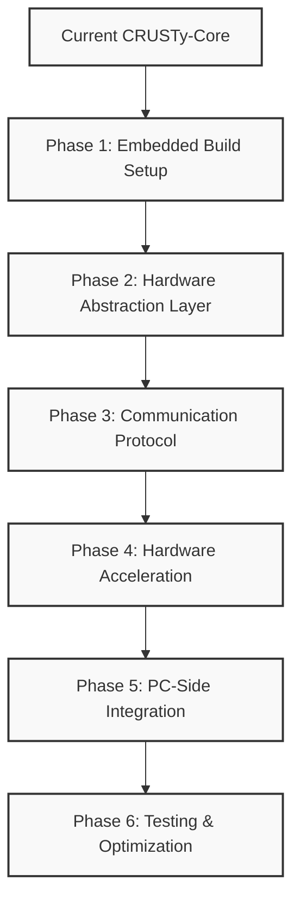

# STM32H573I-DK Embedded Development Guide

This comprehensive guide covers the embedded development aspects of the CRUSTy-Core project, focusing on the STM32H573I-DK microcontroller. It combines the migration roadmap, architecture details, and implementation considerations.

## Table of Contents

1. [Overview](#overview)
2. [Architecture](#architecture)
3. [Migration Strategy](#migration-strategy)
4. [Implementation Details](#implementation-details)
5. [Hardware Acceleration](#hardware-acceleration)
6. [Memory Management](#memory-management)
7. [Security Considerations](#security-considerations)
8. [Development Workflow](#development-workflow)
9. [Testing Strategy](#testing-strategy)

## Overview

CRUSTy-Core's embedded implementation demonstrates a powerful approach to combining Rust and C++ code within a single Cortex-M processor. The embedded implementation runs on STM32H573I-DK hardware, leveraging the strengths of both languages:

- **Rust** handles all input validation, sanitization, and memory-sensitive operations
- **C++** manages core processing, hardware acceleration, and system integration

Both languages are compiled into a single binary through a sophisticated build pipeline that ensures secure and efficient interoperation.

## Architecture

The embedded implementation follows a hybrid architecture that leverages the strengths of both Rust and C++:

```
┌─────────────────────────────────────────────────────────┐
│                  Single Binary Image                    │
│                                                         │
│  ┌─────────────────┐           ┌─────────────────────┐  │
│  │                 │           │                     │  │
│  │   Rust Code     │◄─────────►│     C++ Code        │  │
│  │  (Input Safety) │    FFI    │  (Core Processing)  │  │
│  │                 │ Boundary  │                     │  │
│  └────────┬────────┘           └──────────┬──────────┘  │
│           │                               │             │
│  ┌────────▼────────┐           ┌──────────▼──────────┐  │
│  │  Memory-Safe    │           │   Hardware Access   │  │
│  │  Input Handling │           │   & Acceleration    │  │
│  └─────────────────┘           └─────────────────────┘  │
│                                                         │
└─────────────────────────────────────────────────────────┘
```

### Current System Analysis

CRUSTy-Core currently has:

1. **Hybrid Architecture**:

   - Rust for input handling and memory-safe operations
   - C++ for cryptographic core and file operations
   - Well-defined FFI boundary between languages

2. **Cryptographic Implementation**:

   - AES-256-GCM encryption via Rust's `aes-gcm` crate
   - Argon2id for password hashing and key derivation
   - Clean C++ wrapper around Rust crypto functions

3. **Missing Components for Embedded Target**:
   - STM32H573I-DK hardware abstraction layer
   - Communication protocol between PC and embedded device
   - Hardware acceleration integration
   - Embedded-specific build configuration

## Migration Strategy

The migration to STM32H573I-DK follows a phased approach:



## Implementation Details

### Build Process and Tools

The integration of Rust and C++ code into a single binary involves several specialized tools:

1. **CMake** - Primary build orchestrator that manages the overall build process
2. **Corrosion** - CMake module that integrates Rust's Cargo build system with CMake
3. **cbindgen** - Automatically generates C/C++ headers from Rust code
4. **Cargo** - Rust's package manager and build system
5. **ARM GCC** - C/C++ compiler for the ARM Cortex-M7 target
6. **LLVM** - Backend for Rust compilation to ARM target

The build process follows these steps:

1. Rust code is analyzed by cbindgen to generate C-compatible header files
2. Cargo compiles Rust code to a static library (.a) for the ARM target
3. C++ code is compiled with the generated headers
4. The linker combines both into a single binary
5. The binary is flashed to the STM32H573I-DK hardware

### Memory Management and FFI

Memory management between Rust and C++ is handled through a carefully designed Foreign Function Interface (FFI):

- **Zero-copy data transfer** - Data is passed by reference across the language boundary
- **Explicit ownership** - Clear rules for which language owns memory at each point
- **Safe abstractions** - Unsafe Rust code is contained in small, well-tested modules
- **Error propagation** - Errors are safely translated between languages
- **Resource cleanup** - RAII patterns in both languages ensure proper resource management

Example of the FFI boundary:

```rust
// Rust side
#[no_mangle]
pub unsafe extern "C" fn process_input(
    data: *const u8,
    len: usize,
    output: *mut u8,
    output_len: *mut usize
) -> i32 {
    // Convert raw pointers to Rust slices
    let input = std::slice::from_raw_parts(data, len);

    // Process with Rust's memory safety
    match validate_and_process(input) {
        Ok(result) => {
            // Copy result to output buffer
            if result.len() > unsafe { *output_len } {
                unsafe { *output_len = result.len(); }
                return ERROR_BUFFER_TOO_SMALL;
            }

            let out_slice = unsafe { std::slice::from_raw_parts_mut(output, *output_len) };
            out_slice[..result.len()].copy_from_slice(&result);
            unsafe { *output_len = result.len(); }
            SUCCESS
        },
        Err(e) => e.to_error_code()
    }
}
```

```cpp
// C++ side
extern "C" {
    int32_t process_input(
        const uint8_t* data,
        size_t len,
        uint8_t* output,
        size_t* output_len
    );
}

bool CppProcessor::processData(const std::vector<uint8_t>& input) {
    std::vector<uint8_t> output(MAX_OUTPUT_SIZE);
    size_t output_len = output.size();

    int32_t result = process_input(
        input.data(),
        input.size(),
        output.data(),
        &output_len
    );

    if (result == SUCCESS) {
        output.resize(output_len);
        // Use the processed data
        return true;
    } else {
        // Handle error
        return false;
    }
}
```

## Hardware Acceleration

The embedded implementation leverages STM32H5's hardware cryptographic accelerators:

- **AES-GCM Hardware Engine** - Accelerates encryption/decryption operations
- **SHA Hardware Accelerator** - Speeds up hashing operations
- **True Random Number Generator** - Provides high-quality entropy for key generation
- **PKA (Public Key Accelerator)** - Accelerates asymmetric cryptography operations

C++ code interfaces with these hardware accelerators through the STM32CubeH5 HAL:

```cpp
bool initHardwareAES(AES_HandleTypeDef* haes, const uint8_t* key) {
    haes->Instance = AES;
    haes->Init.DataType = AES_DATATYPE_8B;
    haes->Init.KeySize = AES_KEYSIZE_256;
    haes->Init.OperatingMode = AES_MODE_GCM;
    haes->Init.ChainingMode = AES_CHAINMODE_AES_GCM;
    haes->Init.KeyWriteFlag = AES_KEY_WRITE_ENABLE;

    if (HAL_AES_Init(haes) != HAL_OK) {
        return false;
    }

    return HAL_AES_SetKey(haes, (uint32_t*)key, AES_KEYSIZE_256) == HAL_OK;
}
```

### Conditional Compilation

The codebase uses conditional compilation to support both PC and embedded targets:

```rust
// Rust conditional compilation
#[cfg(feature = "embedded")]
pub fn get_random_bytes(output: &mut [u8]) -> Result<(), Error> {
    // Use hardware RNG on embedded target
    extern "C" {
        fn hw_get_random_bytes(buffer: *mut u8, len: usize) -> i32;
    }

    let result = unsafe { hw_get_random_bytes(output.as_mut_ptr(), output.len()) };
    if result == 0 {
        Ok(())
    } else {
        Err(Error::RngFailure)
    }
}

#[cfg(not(feature = "embedded"))]
pub fn get_random_bytes(output: &mut [u8]) -> Result<(), Error> {
    // Use software RNG on PC target
    use rand::RngCore;
    rand::thread_rng().fill_bytes(output);
    Ok(())
}
```

```cpp
// C++ conditional compilation
#ifdef EMBEDDED_TARGET
void initCrypto() {
    // Initialize hardware crypto
    MX_AES_Init();
    MX_HASH_Init();
    MX_RNG_Init();
}
#else
void initCrypto() {
    // Initialize software crypto
    initOpenSSL();
}
#endif
```

## Memory Management

### Memory Constraints

- **Stack Usage**: Carefully monitor stack usage in both languages
- **Heap Allocation**: Minimize or eliminate heap allocations in critical paths
- **Static Allocation**: Use static buffers where possible for predictable memory usage
- **Memory Pools**: Consider memory pools for dynamic allocations with bounded size

```cpp
// Example of static allocation for buffers
static uint8_t inputBuffer[MAX_INPUT_SIZE];
static uint8_t outputBuffer[MAX_OUTPUT_SIZE];

// Instead of:
// std::vector<uint8_t> inputBuffer(size);
// std::vector<uint8_t> outputBuffer(size);
```

### Performance Optimization

- **Zero-Copy**: Design interfaces to avoid unnecessary copying
- **DMA Integration**: Use DMA for efficient data transfer to/from hardware accelerators
- **Interrupt Handling**: Process data in chunks to maintain responsiveness
- **Power Management**: Implement sleep modes between processing tasks

```cpp
// Example of DMA usage with hardware crypto
void encryptWithDMA(const uint8_t* input, size_t len, uint8_t* output) {
    // Configure DMA for input
    HAL_DMA_Start(&hdma_aes_in, (uint32_t)input, (uint32_t)&AES->DINR, len/4);

    // Configure DMA for output
    HAL_DMA_Start(&hdma_aes_out, (uint32_t)&AES->DOUTR, (uint32_t)output, len/4);

    // Enable DMA mode
    SET_BIT(AES->CR, AES_CR_DMAOUTEN | AES_CR_DMAINEN);

    // Start encryption
    SET_BIT(AES->CR, AES_CR_EN);

    // Wait for completion
    while (HAL_DMA_GetState(&hdma_aes_out) != HAL_DMA_STATE_READY) {
        // Could yield to other tasks here
    }
}
```

## Security Considerations

### Secure Boot

Implement secure boot to verify firmware integrity:

- Verify firmware signature before execution
- Implement anti-rollback protection
- Secure key storage for verification keys

### Memory Protection

Use MPU to isolate sensitive operations:

```cpp
// Example of MPU configuration for secure memory regions
void configureMPU() {
    MPU_Region_InitTypeDef MPU_InitStruct;

    // Disable MPU
    HAL_MPU_Disable();

    // Configure secure memory region
    MPU_InitStruct.Enable = MPU_REGION_ENABLE;
    MPU_InitStruct.Number = MPU_REGION_NUMBER0;
    MPU_InitStruct.BaseAddress = SECURE_MEMORY_BASE;
    MPU_InitStruct.Size = MPU_REGION_SIZE_4KB;
    MPU_InitStruct.SubRegionDisable = 0x00;
    MPU_InitStruct.TypeExtField = MPU_TEX_LEVEL0;
    MPU_InitStruct.AccessPermission = MPU_REGION_PRIV_RW;
    MPU_InitStruct.DisableExec = MPU_INSTRUCTION_ACCESS_DISABLE;
    MPU_InitStruct.IsShareable = MPU_ACCESS_NOT_SHAREABLE;
    MPU_InitStruct.IsCacheable = MPU_ACCESS_NOT_CACHEABLE;
    MPU_InitStruct.IsBufferable = MPU_ACCESS_NOT_BUFFERABLE;

    HAL_MPU_ConfigRegion(&MPU_InitStruct);

    // Enable MPU
    HAL_MPU_Enable(MPU_PRIVILEGED_DEFAULT);
}
```

### Side-Channel Protection

Implement countermeasures against timing and power analysis:

- Constant-time cryptographic operations
- Random delays and jitter
- Power consumption balancing

### Key Management

Secure key storage and management:

- Store keys in secure memory regions
- Implement key derivation from device-unique identifiers
- Implement key rotation and revocation

### Debug Protection

Disable debug interfaces in production:

- Implement debug authentication
- Disable JTAG/SWD in production builds
- Implement tamper detection

## Development Workflow

### Phase 1: Embedded Build Setup

#### ARM Toolchain Configuration

Create a CMake toolchain file for the STM32H573I-DK target:

```cmake
# cmake/arm-none-eabi.cmake
set(CMAKE_SYSTEM_NAME Generic)
set(CMAKE_SYSTEM_PROCESSOR ARM)

set(CMAKE_C_COMPILER arm-none-eabi-gcc)
set(CMAKE_CXX_COMPILER arm-none-eabi-g++)
set(CMAKE_ASM_COMPILER arm-none-eabi-gcc)

set(CMAKE_C_FLAGS "-mcpu=cortex-m33 -mthumb -mfloat-abi=hard -mfpu=fpv5-sp-d16 -ffunction-sections -fdata-sections -Wall -Wextra" CACHE INTERNAL "C compiler flags")
set(CMAKE_CXX_FLAGS "${CMAKE_C_FLAGS} -fno-exceptions -fno-rtti" CACHE INTERNAL "C++ compiler flags")
set(CMAKE_ASM_FLAGS "-mcpu=cortex-m33 -mthumb -mfloat-abi=hard -mfpu=fpv5-sp-d16" CACHE INTERNAL "ASM compiler flags")
set(CMAKE_EXE_LINKER_FLAGS "-mcpu=cortex-m33 -mthumb -mfloat-abi=hard -mfpu=fpv5-sp-d16 -Wl,--gc-sections -Wl,--print-memory-usage" CACHE INTERNAL "Linker flags")

set(CMAKE_FIND_ROOT_PATH_MODE_PROGRAM NEVER)
set(CMAKE_FIND_ROOT_PATH_MODE_LIBRARY ONLY)
set(CMAKE_FIND_ROOT_PATH_MODE_INCLUDE ONLY)
set(CMAKE_FIND_ROOT_PATH_MODE_PACKAGE ONLY)
```

#### Rust Configuration for Embedded Target

Update Cargo.toml for embedded target:

```toml
# rust/crypto/Cargo.toml
[package]
name = "crypto"
version = "0.1.0"
edition = "2021"

[lib]
name = "crypto"
crate-type = ["staticlib", "rlib"]

[features]
default = ["std"]
std = ["aes-gcm/std", "rand/std"]
embedded = []

[dependencies]
aes-gcm = { version = "0.10.1", default-features = false }
argon2 = { version = "0.4.1", default-features = false }
rand = { version = "0.8.5", default-features = false }
zeroize = "1.5.7"

[target.'cfg(target_arch = "arm")'.dependencies]
cortex-m = "0.7.7"
cortex-m-rt = "0.7.2"
stm32h5 = "0.15.1"
```

#### CMake Configuration for Embedded Target

Update CMakeLists.txt for embedded target:

```cmake
# CMakeLists.txt
cmake_minimum_required(VERSION 3.15)
project(CRUSTy-Core)

# Options
option(BUILD_EMBEDDED_TARGET "Build for STM32H573I-DK target" OFF)
option(USE_QT "Build with Qt GUI" ON)

# Rust integration
include(cmake/Corrosion.cmake)
corrosion_import_crate(MANIFEST_PATH rust/crypto/Cargo.toml)

# Common components
add_library(cpp_crypto_core
    src/cpp/core/encryptor.cpp
    src/cpp/core/file_operations.cpp
)

# Embedded target
if(BUILD_EMBEDDED_TARGET)
    # STM32CubeH5 HAL
    add_subdirectory(stm32cube_hal)

    # Embedded firmware
    add_executable(crusty_embedded
        src/cpp/embedded_main.cpp
        src/cpp/embedded/hardware_init.cpp
        src/cpp/embedded/comm_protocol.cpp
        src/cpp/embedded/command_handlers.cpp
    )

    target_link_libraries(crusty_embedded PRIVATE
        cpp_crypto_core
        crypto
        stm32h5_hal
    )

    target_compile_definitions(crusty_embedded PRIVATE
        EMBEDDED_TARGET
        STM32H573xx
        NO_QT_UI
    )

    # Post-build command to generate binary file
    add_custom_command(TARGET crusty_embedded POST_BUILD
        COMMAND arm-none-eabi-objcopy -O binary $<TARGET_FILE:crusty_embedded> $<TARGET_FILE_DIR:crusty_embedded>/crusty_embedded.bin
        COMMENT "Generating binary file"
    )
endif()
```

### Phase 2: Hardware Abstraction Layer

Create a hardware abstraction layer for the STM32H573I-DK:

```cpp
// src/cpp/embedded/hardware_init.h
#pragma once

#include <cstdint>
#include <stm32h5xx_hal.h>

// Hardware initialization
bool initHardware();
void configureClocks();
void configureMPU();
void configurePeripherals();

// Hardware crypto acceleration
bool initHardwareAES(AES_HandleTypeDef* haes, const uint8_t* key);
bool hardwareAESGCMEncrypt(AES_HandleTypeDef* haes, const uint8_t* input, size_t input_len,
                          const uint8_t* iv, size_t iv_len,
                          const uint8_t* aad, size_t aad_len,
                          uint8_t* output, uint8_t* tag);
bool hardwareAESGCMDecrypt(AES_HandleTypeDef* haes, const uint8_t* input, size_t input_len,
                          const uint8_t* iv, size_t iv_len,
                          const uint8_t* aad, size_t aad_len,
                          uint8_t* output, const uint8_t* tag);

// Random number generation
bool getHardwareRandomBytes(uint8_t* buffer, size_t len);

// Power management
void enterLowPowerMode();
void exitLowPowerMode();
```

### Phase 3: Communication Protocol

Define a communication protocol between the PC and the STM32H573I-DK:

```cpp
// src/cpp/embedded/comm_protocol.h
#pragma once

#include <cstdint>
#include <array>

// Command types
enum CommandType : uint8_t {
    CMD_ENCRYPT = 0x01,
    CMD_DECRYPT = 0x02,
    CMD_KEY_GEN = 0x03,
    CMD_STATUS = 0x04,
    CMD_RESET = 0x05
};

// Error codes
enum ErrorCode : uint8_t {
    SUCCESS = 0x00,
    INVALID_COMMAND = 0x01,
    AUTHENTICATION_FAILED = 0x02,
    ENCRYPTION_ERROR = 0x03,
    DECRYPTION_ERROR = 0x04,
    KEY_GEN_ERROR = 0x05,
    BUFFER_TOO_SMALL = 0x06,
    INTERNAL_ERROR = 0x07
};

// Magic numbers
constexpr uint16_t PROTOCOL_MAGIC = 0xC3C3;
constexpr uint8_t PROTOCOL_VERSION = 0x01;

// Message structures
#pragma pack(push, 1)
struct CommandHeader {
    uint16_t magic;
    uint8_t type;
    uint32_t length;
    uint32_t command_id;
};

struct ResponseHeader {
    uint16_t magic;
    uint8_t type;
    uint32_t length;
    uint32_t command_id;
    uint8_t status;
};
#pragma pack(pop)

class Protocol {
public:
    // Initialize communication
    bool init();

    // Check for available commands
    bool commandAvailable();

    // Receive a command
    bool receiveCommand(uint8_t* buffer, size_t buffer_size, size_t* command_size);

    // Send a response
    bool sendResponse(const uint8_t* buffer, size_t response_size);

    // Send an error response
    bool sendErrorResponse(uint32_t command_id, ErrorCode error);

private:
    // UART handle
    UART_HandleTypeDef huart;

    // Calculate CRC
    uint16_t calculateCRC(const uint8_t* data, size_t length);

    // Validate message format
    bool validateMessageFormat(const uint8_t* buffer, size_t length);
};
```

### Phase 4: Hardware Acceleration

Adapt the Rust crypto library to support hardware acceleration:

```rust
// rust/crypto/src/lib.rs
#[cfg(feature = "embedded")]
extern "C" {
    fn hw_aes_gcm_encrypt(
        data: *const u8, data_len: usize,
        key: *const u8, key_len: usize,
        iv: *const u8, iv_len: usize,
        aad: *const u8, aad_len: usize,
        output: *mut u8, tag: *mut u8
    ) -> i32;

    fn hw_aes_gcm_decrypt(
        data: *const u8, data_len: usize,
        key: *const u8, key_len: usize,
        iv: *const u8, iv_len: usize,
        aad: *const u8, aad_len: usize,
        output: *mut u8, tag: *const u8
    ) -> i32;

    fn hw_random_bytes(buffer: *mut u8, len: usize) -> i32;
}

#[cfg(feature = "embedded")]
pub fn encrypt_with_hardware(
    data: &[u8],
    key: &[u8],
    iv: &[u8],
    aad: &[u8]
) -> Result<(Vec<u8>, [u8; 16]), Error> {
    let mut output = vec![0u8; data.len()];
    let mut tag = [0u8; 16];

    let result = unsafe {
        hw_aes_gcm_encrypt(
            data.as_ptr(), data.len(),
            key.as_ptr(), key.len(),
            iv.as_ptr(), iv.len(),
            aad.as_ptr(), aad.len(),
            output.as_mut_ptr(), tag.as_mut_ptr()
        )
    };

    if result == 0 {
        Ok((output, tag))
    } else {
        Err(Error::EncryptionFailed)
    }
}
```

## Testing Strategy

### Unit Testing

1. Test each component individually:

   - Hardware initialization
   - Cryptographic operations
   - Communication protocol
   - Command handlers

2. Use mock implementations for hardware dependencies:
   - Mock HAL functions
   - Mock hardware accelerators
   - Mock communication interfaces

### Integration Testing

1. Test the complete system:

   - PC to embedded device communication
   - End-to-end encryption/decryption
   - Error handling and recovery
   - Performance under load

2. Test with both software and hardware implementations:
   - Compare results between software and hardware implementations
   - Verify consistent behavior across implementations

### Performance Testing

1. Measure and optimize performance:

   - Encryption/decryption throughput
   - Communication latency
   - Memory usage
   - Power consumption

2. Compare with PC implementation:
   - Benchmark against PC implementation
   - Identify performance bottlenecks
   - Optimize critical paths

### Security Testing

1. Verify security properties:

   - Memory protection effectiveness
   - Side-channel resistance
   - Secure boot implementation
   - Key management security

2. Perform penetration testing:
   - Attempt to bypass security measures
   - Test against known attack vectors
   - Verify error handling security

## Conclusion

This guide provides a comprehensive approach to developing for the STM32H573I-DK embedded target. By following the migration strategy and implementation details outlined here, you can successfully port CRUSTy-Core to the embedded platform while maintaining the security and performance benefits of the hybrid Rust/C++ architecture.

The key benefits of this approach include:

1. **Memory Safety**: Rust's ownership model ensures memory safety for all input handling
2. **Performance**: C++ and hardware acceleration provide optimal performance
3. **Security**: Hardware security features enhance protection against attacks
4. **Flexibility**: The hybrid architecture supports both PC and embedded targets
5. **Maintainability**: Clear separation of concerns makes the codebase easier to maintain
