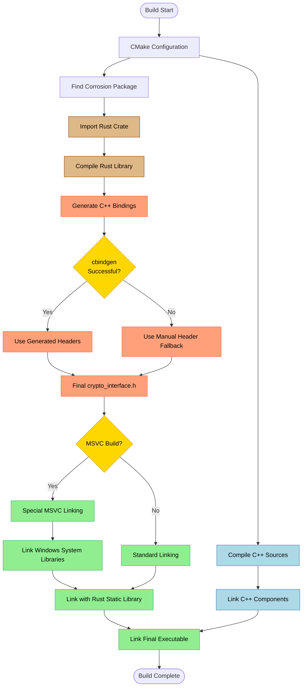

# CRUSTy-Core Build System Flow Diagram

This diagram illustrates the complete build process for the CRUSTy-Core project, showing how Rust and C++ components are compiled and linked together.

## Build Process Explained

1. **CMake Configuration**: The build process starts with CMake configuring the build based on CMakeLists.txt
2. **Corrosion Integration**: CMake finds and integrates the Corrosion package for Rust support
3. **Rust Compilation**:
   - The Rust crate is imported and compiled
   - cbindgen attempts to generate C++ bindings for the Rust functions
   - If cbindgen fails, a manual header fallback is used
4. **C++ Compilation**: C++ source files are compiled independently
5. **Platform-Specific Linking**:
   - For MSVC builds, special linking logic is applied
   - Windows system libraries are explicitly linked
   - For other platforms, standard linking is used
6. **Final Linking**:
   - The Rust static library is linked with the C++ components
   - The final executable is generated

This multi-stage process ensures that both Rust and C++ components are properly integrated regardless of platform or build tools.
