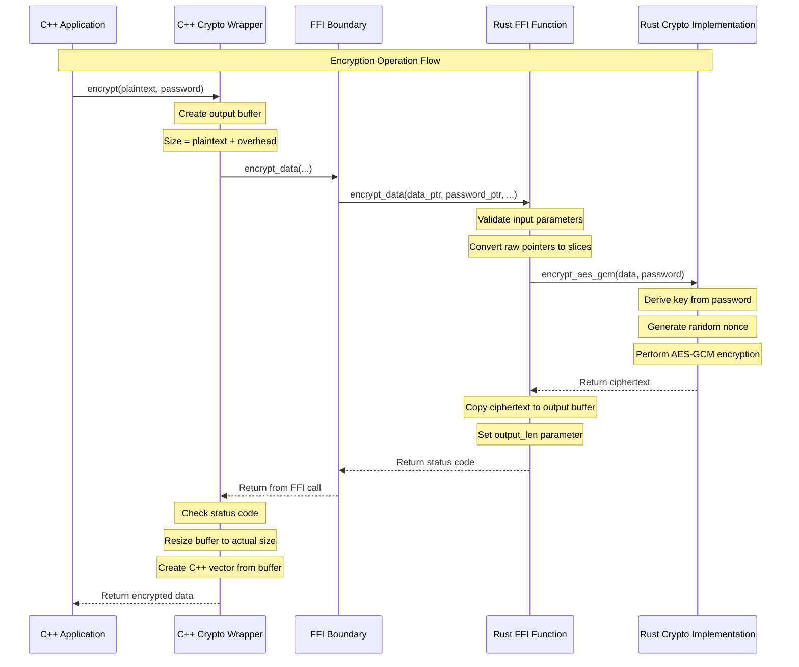
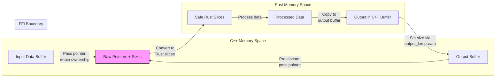
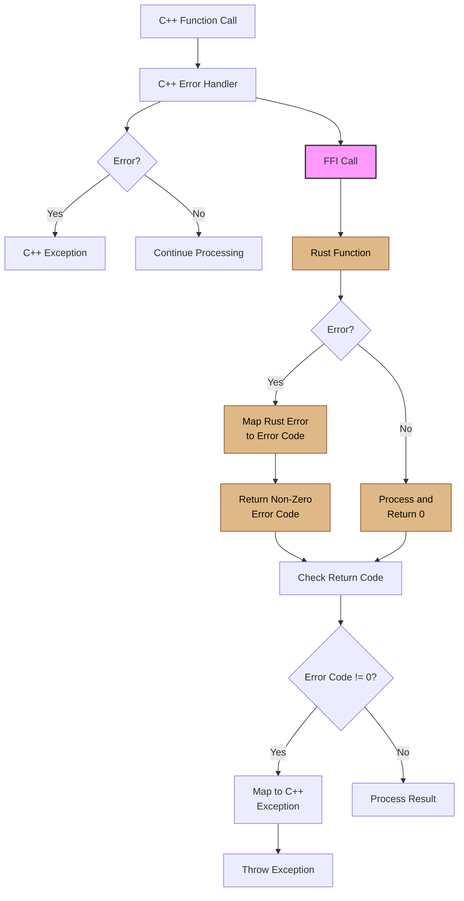
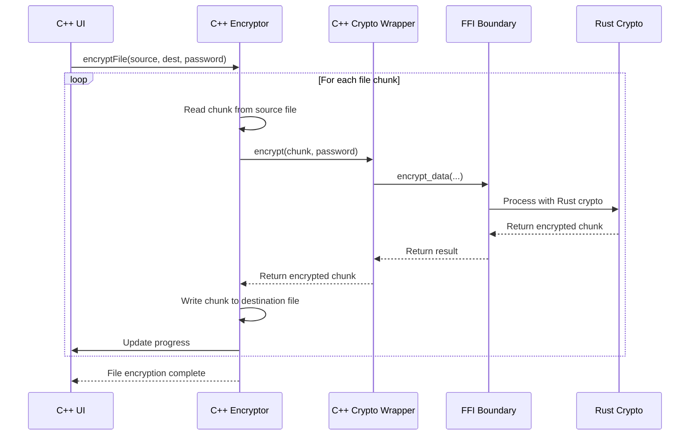

# CRUSTy-Core Data Flow Between C++ and Rust

This document illustrates how data flows between C++ and Rust components during cryptographic operations in the CRUSTy-Core project.

## Encryption Data Flow

The following diagram shows the complete journey of data during an encryption operation, from the C++ application through to the Rust crypto implementation and back:

## Memory Management During Cross-Language Operations

## Error Handling Across Language Boundary

## Key Components and Their Interactions

The table below summarizes how different components interact across the language boundary:

| Component                  | Language | Role in Integration                      | Interfaces With       |
| -------------------------- | -------- | ---------------------------------------- | --------------------- |
| `Encryptor`                | C++      | High-level API for encryption operations | `Crypto` C++ wrapper  |
| `Crypto`                   | C++      | Wraps Rust FFI functions in C++ API      | FFI functions         |
| `crypto_interface.h`       | C/C++    | Defines FFI boundary                     | Both C++ and Rust     |
| Rust FFI Functions         | Rust     | Expose Rust functionality to C++         | C++ via FFI           |
| Rust Crypto Implementation | Rust     | Core cryptographic operations            | Rust crypto libraries |

## Implementation Benefits

This integration approach offers several key benefits:

1. **Memory Safety**: Rust handles sensitive cryptographic operations with its memory safety guarantees
2. **Performance**: Minimal overhead for crossing the language boundary
3. **Type Safety**: C++ wrappers provide type-safe interfaces to Rust functions
4. **Error Handling**: Clear mapping between Rust results and C++ exceptions
5. **Modularity**: Each language handles the tasks it's best suited for

## Real-World Example: Handling a File Encryption Operation

This diagram shows how the system handles a real file encryption operation, breaking the file into chunks to process efficiently while maintaining a responsive UI.
