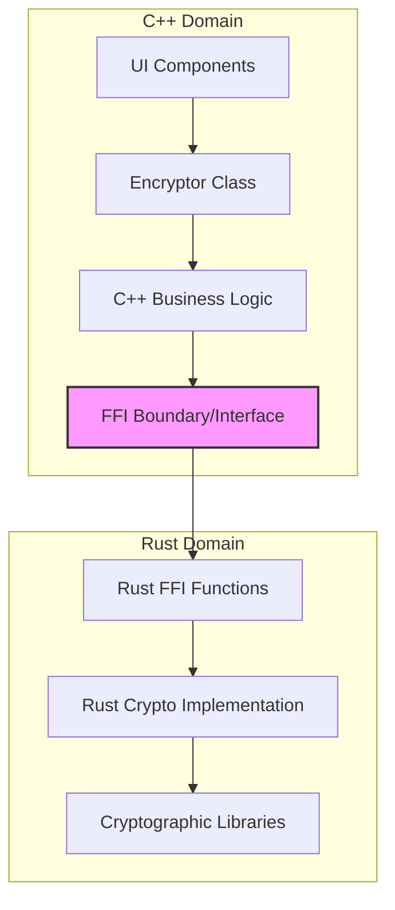
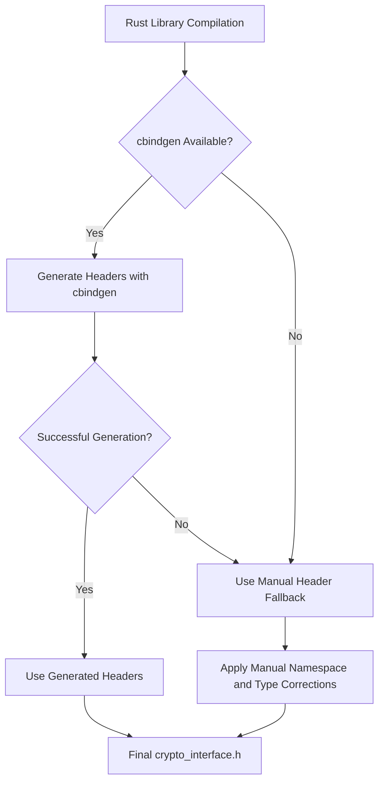

# CRUSTy-Core: Rust-C++ Integration Architecture

## Introduction

CRUSTy-Core implements a hybrid architecture that leverages both Rust and C++ to create a secure, high-performance cryptographic system. This document explains how these two languages are integrated into a single cohesive binary.

### Purpose of the Dual-Language Implementation

The CRUSTy-Core project combines the strengths of both languages:

- **Rust**: Provides memory safety, modern language features, and excellent cryptographic libraries
- **C++**: Offers performance, compatibility with existing systems, and rich UI capabilities

By using Rust for the cryptographic core and C++ for application logic and UI, CRUSTy-Core achieves both security and functionality without compromising either.

## Architecture Overview

CRUSTy-Core follows a layered architecture with clear boundaries between language domains:



In this architecture:

1. **C++ Domain**: Handles user interface, file operations, application logic, and provides a clean API for cryptographic operations
2. **FFI Boundary**: Defined by a C-compatible interface that allows C++ to call into Rust code
3. **Rust Domain**: Implements cryptographic primitives securely and efficiently

## FFI Interface Design

### Interface Overview

The FFI boundary is defined in `crypto_interface.h`, which is generated from Rust code using cbindgen (with a manual fallback mechanism). This header defines:

- Error codes for communicating status across the language boundary
- Function signatures for cryptographic operations
- Data types that can be safely passed between languages

### Error Handling Mechanism

Error handling across the FFI boundary uses integer error codes that are defined in an enum:

```cpp
enum class CryptoErrorCode {
    Success = 0,
    InvalidParams = -1,
    AuthenticationFailed = -2,
    EncryptionError = -3,
    DecryptionError = -4,
    KeyDerivationError = -5,
    BufferTooSmall = -6,
    InternalError = -7,
    HardwareNotAvailable = -8
};
```

These error codes are returned from Rust functions and then mapped to C++ exceptions in the wrapper code:

```cpp
// Map from Rust crypto error codes to our C++ error codes
CryptoErrorCode mapErrorCode(int32_t rustErrorCode) {
    switch (rustErrorCode) {
        case -1: // InvalidParams
            return CryptoErrorCode::InvalidPassword;
        case -2: // AuthenticationFailed
            return CryptoErrorCode::AuthenticationFailed;
        // ...
    }
}
```

### Memory Management

Memory management across the FFI boundary follows these principles:

1. **Ownership**: The caller (C++ side) maintains ownership of all memory
2. **Buffers**: The C++ code allocates buffers and passes pointers to Rust
3. **Buffer Sizes**: Buffer sizes are explicitly passed to prevent overflow
4. **Output Lengths**: Actual output lengths are returned through out parameters

This approach avoids complex memory ownership issues while maintaining safety.

## Build System Integration

### Corrosion Integration

CRUSTy-Core uses Corrosion to integrate Rust into the CMake build system:

```cmake
# Set up Corrosion for Rust integration
list(APPEND CMAKE_PREFIX_PATH "${CMAKE_CURRENT_SOURCE_DIR}/cmake/corrosion/corrosion-0.4.7")
find_package(Corrosion REQUIRED)

# Add Rust crypto library with the "std" feature enabled
corrosion_import_crate(MANIFEST_PATH rust/crypto/Cargo.toml FEATURES "std")
```

Corrosion handles the building of Rust crates and makes them available to CMake as libraries that can be linked against C++ executables.

### Header Generation Process

The build system uses a multi-stage process to generate the FFI headers:



This process ensures reliable header generation even if cbindgen fails or produces incorrect output.

### Platform-Specific Considerations

The build system includes special handling for Microsoft Visual C++ (MSVC):

```cmake
# For MSVC, we need special handling of the Rust libraries
if(MSVC)
    target_link_libraries(crusty_cli PRIVATE
        cpp_components
    )
    # Link directly with the generated Rust static library file
    # This avoids the problematic default lib flags
    target_link_libraries(crusty_cli PRIVATE
        "${CMAKE_CURRENT_BINARY_DIR}/rust_crypto.lib"
        msvcrt
        kernel32
        advapi32
        ntdll
        userenv
        ws2_32
        dbghelp
    )
else()
    target_link_libraries(crusty_cli PRIVATE
        cpp_components
        rust_crypto
    )
endif()
```

This approach solves linking issues specific to MSVC, which requires explicit linking with Windows system libraries.

## Implementation Details

### Rust Implementation Patterns

The Rust side of the FFI boundary follows these implementation patterns:

1. **C-compatible Functions**: Exported functions use `extern "C"` and follow C calling conventions
2. **No Complex Types**: Only primitive types and pointers cross the FFI boundary
3. **Error Codes**: Functions return integer error codes instead of Rust's `Result` type
4. **Safe Wrapper Functions**: Unsafe FFI functions are wrapped in safe functions on the Rust side

### C++ Wrapper Approach

On the C++ side, the raw FFI functions are wrapped in a clean, object-oriented API:

```cpp
std::vector<uint8_t> Crypto::encrypt(
    const std::vector<uint8_t>& plaintext,
    const std::string& password
) const {
    // Create output buffer
    std::vector<uint8_t> output(plaintext.size() + 32);
    size_t output_len = 0;

    // Call Rust function through FFI
    int32_t result = crusty::crypto::encrypt_data(
        plaintext.data(), plaintext.size(),
        reinterpret_cast<const uint8_t*>(password.c_str()),
        password.size(),
        output.data(), output.size(),
        &output_len
    );

    // Handle errors
    if (result != 0) {
        // ...error handling...
    }

    // Resize to actual output length
    output.resize(output_len);
    return output;
}
```

This approach provides a natural C++ API that hides the complexity of the FFI layer.

## Technical Challenges and Solutions

### cbindgen Issues

The project encountered issues with cbindgen not properly generating headers, particularly with namespaces and types. The solution was to implement a manual fallback header generation mechanism in `build.rs`:

```rust
// Manual header generation as a fallback
let mut header_content = String::from("/* This file was generated by cbindgen */\n#pragma once\n\n");
header_content.push_str("#include <stdint.h>\n#include <stddef.h>\n\n");
header_content.push_str("namespace crusty {\nnamespace crypto {\n\n");

// ... add enum definitions and function declarations ...

header_content.push_str("} // namespace crypto\n");
header_content.push_str("} // namespace crusty\n");
```

This ensures that even if cbindgen fails, a valid header is still generated.

### MSVC Linking Challenges

Linking with MSVC presented challenges due to how it handles static libraries and symbol resolution:

1. **Direct Library Linking**: The build system links directly with the generated `.lib` file
2. **System Libraries**: Explicit linking with Windows system libraries is required
3. **LTO Issues**: Link-time optimization can cause problems and may need to be disabled

These challenges were addressed in the CMake configuration with platform-specific logic.

### Namespace Handling

Properly maintaining C++ namespaces in generated headers required special handling:

1. **Manual Namespace Insertion**: The fallback mechanism manually adds namespace declarations
2. **Consistent Usage**: All FFI functions are accessed with full namespace qualification
3. **Namespace Structure**: The `crusty::crypto` namespace hierarchy mirrors the project structure

## Workflow Example: Encryption Operation

To illustrate how the system works in practice, here's how an encryption operation flows through the system:

1. **C++ Application** calls `Crypto::encrypt()` with plaintext and password
2. **C++ Wrapper** prepares buffers and calls `crusty::crypto::encrypt_data()` through FFI
3. **Rust FFI Function** receives the call and validates inputs
4. **Rust Crypto Implementation** performs the actual encryption using Rust crypto libraries
5. **Return Journey**: The encrypted data is placed in the output buffer and its length is set
6. **C++ Wrapper** checks the return code, handles any errors, and returns the result
7. **C++ Application** receives the encrypted data as a standard C++ `std::vector`

This approach maintains type safety and memory safety while providing a natural API in both languages.

## Recommendations for Extending the System

### Adding New FFI Functions

When adding new functions to the FFI interface:

1. Define the function in Rust with proper FFI compatibility attributes
2. Update `cbindgen.toml` to include the new function
3. Add the function signature to the manual fallback mechanism in `build.rs`
4. Create a C++ wrapper that provides a natural API for the function
5. Add proper error handling and memory management

### Error Handling Considerations

To maintain robust error handling:

1. Use integer error codes for FFI functions
2. Define new error codes in the `CryptoErrorCode` enum if needed
3. Update the `mapErrorCode` function to map Rust error codes to C++ error codes
4. Document error conditions and expected behaviors

### Testing Cross-Language Integration

Testing the integration requires:

1. Unit tests for individual Rust functions
2. Unit tests for C++ wrapper functions
3. Integration tests that cross the language boundary
4. Stress tests for memory management and error handling
5. Platform-specific tests for MSVC and other compilers

## Conclusion

The CRUSTy-Core project demonstrates how to effectively combine Rust and C++ in a single application, leveraging the strengths of both languages. The careful design of the FFI boundary, robust build system integration, and thoughtful error handling ensure that the integration is both safe and maintainable.

By using Rust for cryptographic operations and C++ for application logic, CRUSTy-Core achieves strong security guarantees without sacrificing flexibility or performance. This hybrid approach serves as a model for other projects looking to integrate these languages.
