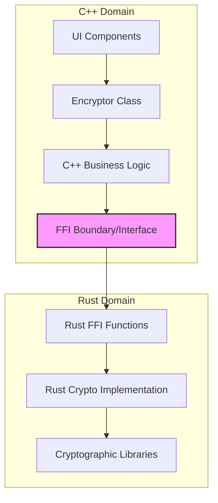
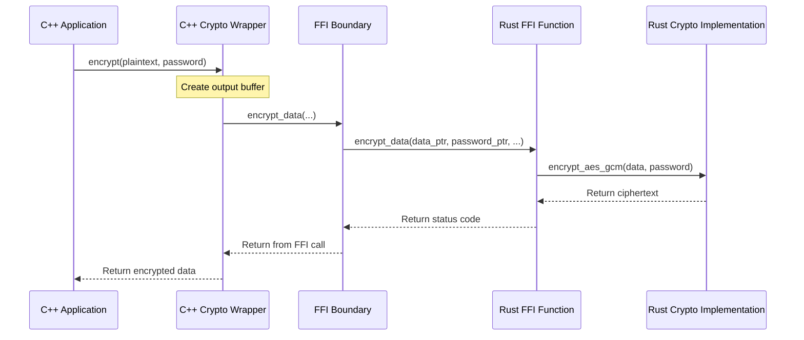

# CRUSTy-Core: Rust-C++ Integration Architecture

## Introduction

CRUSTy-Core combines Rust and C++ in a hybrid architecture that leverages the strengths of both languages to create a secure, high-performance cryptographic system. This document explains the integration approach and implementation details.

**Key Benefits:**

- **Rust**: Memory safety, secure cryptographic primitives
- **C++**: Application logic, UI capabilities, system integration
- **Combined**: Security without performance compromise

## Architecture Overview

The system uses a layered architecture with a well-defined FFI boundary:



This architecture separates concerns: C++ handles user interaction and application logic, while Rust provides memory-safe cryptographic operations. The FFI boundary ensures clean integration between the languages.

## FFI Interface Design

The interface between Rust and C++ is defined in `crypto_interface.h`, which is generated from Rust code using cbindgen (with a manual fallback mechanism).

### Error Handling

Error codes are returned from Rust to C++ and mapped to appropriate exceptions:

```cpp
// Rust error enum (simplified)
enum class CryptoErrorCode {
    Success = 0,
    InvalidParams = -1,
    // Additional error codes...
};
```

The C++ wrapper maps these integer error codes to type-safe exceptions, providing a natural C++ API that hides FFI complexity.

### Memory Management

Memory management follows these principles:

1. C++ code maintains ownership of all memory
2. Buffers are allocated in C++ and passed to Rust via pointers
3. Size parameters prevent buffer overflows
4. Actual output lengths are returned through out parameters

## Build Process Integration

The build process integrates Rust into the C++ build system using Corrosion:

```cmake
# Set up Corrosion for Rust integration
list(APPEND CMAKE_PREFIX_PATH "${CMAKE_CURRENT_SOURCE_DIR}/cmake/corrosion/corrosion-0.4.7")
find_package(Corrosion REQUIRED)
# Import Rust crate with features
```

### Header Generation and Fallback

The build system uses a multi-stage approach for generating FFI headers:

1. Attempt to generate headers using cbindgen
2. If successful, use the generated headers
3. If unsuccessful, fall back to manual header generation
4. Apply namespace and type corrections as needed

Special handling exists for MSVC builds, which require explicit linking with Windows system libraries to resolve symbol resolution issues.

## Data Flow Visualization

This sequence diagram shows the journey of data during an encryption operation:



### Example C++ Wrapper Implementation

The C++ wrapper provides a clean, object-oriented API over the raw FFI functions:

```cpp
std::vector<uint8_t> Crypto::encrypt(
    const std::vector<uint8_t>& plaintext,
    const std::string& password
) const {
    // Call Rust function through FFI and handle errors...
}
```

## Implementation Challenges and Solutions

### cbindgen Issues

The project faced challenges with cbindgen not properly generating headers, particularly with namespaces and types. The solution was implementing a manual fallback header generation in `build.rs` that creates a valid header even if cbindgen fails.

### MSVC Linking Challenges

Linking with MSVC required special handling:

- Direct linking with the generated `.lib` file
- Explicit linking with Windows system libraries
- Platform-specific linking logic in CMake

### Namespace Handling

Properly maintaining C++ namespaces in generated headers required:

- Manual namespace insertion in the fallback mechanism
- Consistent namespace qualification in all FFI calls

## Real-World Application: File Encryption

For file encryption operations, the system processes files in chunks:

1. C++ code reads chunks from the source file
2. Each chunk is passed to Rust for encryption
3. The encrypted chunks are written to the destination file
4. Progress is reported back to the UI

This approach maintains responsive UI while processing large files efficiently.

## Recommendations for Extending the System

When adding new FFI functions:

1. Define the function in Rust with proper FFI compatibility
2. Update `cbindgen.toml` to include the new function
3. Add the function to the manual fallback in `build.rs`
4. Create a C++ wrapper with proper error handling

For error handling:

- Use integer error codes for FFI functions
- Map error codes to appropriate C++ exceptions
- Document error conditions and expected behaviors

## Conclusion

CRUSTy-Core demonstrates an effective approach to combining Rust and C++ in a single application. By carefully designing the FFI boundary, implementing robust error handling, and addressing platform-specific challenges, the project achieves both security and functionality without compromise.

The techniques used in this project can serve as a model for other systems seeking to integrate Rust's memory safety with C++'s system integration capabilities.
