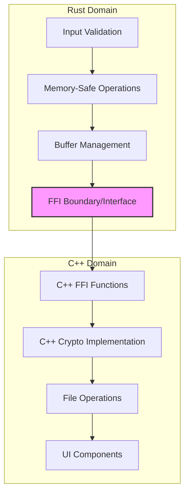
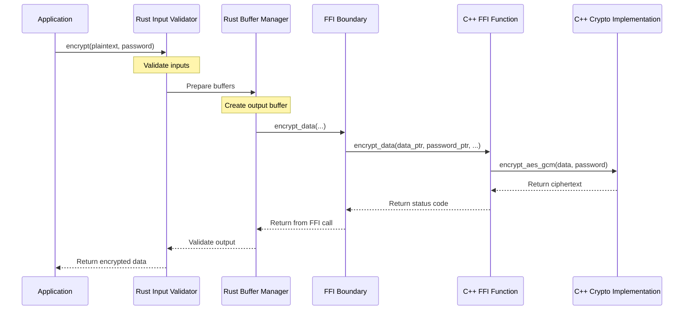

# CRUSTy-Core: Rust-C++ Integration Architecture

## Introduction

CRUSTy-Core combines Rust and C++ in a hybrid architecture that leverages the strengths of both languages to create a secure, high-performance cryptographic system. This document explains the integration approach and implementation details.

**Key Benefits:**

- **Rust**: Memory safety, secure input validation, robust error prevention
- **C++**: High-performance cryptographic implementation, file operations, system integration
- **Combined**: Security without performance compromise

## Architecture Overview

The system uses a layered architecture with a well-defined FFI boundary:



This architecture separates concerns: Rust handles input validation and memory-safe operations, while C++ provides high-performance cryptographic implementations and file operations. The FFI boundary ensures clean integration between the languages.

## FFI Interface Design

The interface between Rust and C++ is defined in `rust_interface.h`, which is generated from Rust code using cbindgen (with a manual fallback mechanism).

### Error Handling

Error codes are returned from C++ to Rust and mapped to appropriate Rust error types:

```cpp
// C++ error enum (simplified)
enum class CryptoErrorCode {
    Success = 0,
    InvalidParams = -1,
    // Additional error codes...
};
```

The Rust wrapper maps these integer error codes to type-safe Rust errors, providing a natural Rust API that hides FFI complexity.

### Memory Management

Memory management follows these principles:

1. Rust code validates inputs and maintains ownership of input buffers
2. Output buffers are allocated in Rust and passed to C++ via pointers
3. Size parameters prevent buffer overflows
4. Actual output lengths are returned through out parameters
5. Rust enforces memory safety before and after C++ operations

## Build Process Integration

The build process integrates C++ cryptographic libraries into the Rust build system using Corrosion:

```cmake
# Set up Corrosion for Rust integration
list(APPEND CMAKE_PREFIX_PATH "${CMAKE_CURRENT_SOURCE_DIR}/cmake/corrosion/corrosion-0.4.7")
find_package(Corrosion REQUIRED)
# Import Rust crate with features
```

### Header Generation and Fallback

The build system uses a multi-stage approach for generating FFI headers:

1. Attempt to generate headers using cbindgen
2. If successful, use the generated headers
3. If unsuccessful, fall back to manual header generation
4. Apply namespace and type corrections as needed

Special handling exists for MSVC builds, which require explicit linking with Windows system libraries to resolve symbol resolution issues.

## Data Flow Visualization

This sequence diagram shows the journey of data during an encryption operation:



### Example Rust Wrapper Implementation

The Rust wrapper provides a clean, memory-safe API over the raw FFI functions:

```rust
pub fn encrypt(plaintext: &[u8], password: &str) -> Result<Vec<u8>, CryptoError> {
    // Validate inputs
    if plaintext.is_empty() || password.is_empty() {
        return Err(CryptoError::InvalidInput);
    }

    // Create output buffer with appropriate size
    let mut output = vec![0u8; plaintext.len() + CRYPTO_OVERHEAD];
    let mut output_len: usize = 0;

    // Call C++ function through FFI
    let status = unsafe {
        ffi::encrypt_data(
            plaintext.as_ptr(),
            plaintext.len(),
            password.as_ptr() as *const u8,
            password.len(),
            output.as_mut_ptr(),
            output.len(),
            &mut output_len as *mut usize
        )
    };

    // Map C++ error code to Rust error
    if status != 0 {
        return Err(map_error_code(status));
    }

    // Resize output to actual size
    output.truncate(output_len);
    Ok(output)
}
```

### Example C++ Cryptographic Implementation

The C++ implementation provides high-performance cryptographic operations:

```cpp
int encrypt_aes_gcm(
    const uint8_t* data, size_t data_len,
    const uint8_t* password, size_t password_len,
    uint8_t* output, size_t output_capacity,
    size_t* output_len
) {
    // Derive encryption key from password
    std::vector<uint8_t> key = derive_key_from_password(password, password_len);

    // Generate random IV
    std::array<uint8_t, IV_SIZE> iv = generate_random_iv();

    // Setup AES-GCM
    gcry_cipher_hd_t handle;
    gcry_error_t err = gcry_cipher_open(&handle, GCRY_CIPHER_AES256, GCRY_CIPHER_MODE_GCM, 0);
    if (err) {
        return CryptoErrorCode::LibraryError;
    }

    // Set key and IV
    err = gcry_cipher_setkey(handle, key.data(), key.size());
    if (err) {
        gcry_cipher_close(handle);
        return CryptoErrorCode::KeyError;
    }

    err = gcry_cipher_setiv(handle, iv.data(), iv.size());
    if (err) {
        gcry_cipher_close(handle);
        return CryptoErrorCode::IvError;
    }

    // Encrypt data
    if (output_capacity < data_len + IV_SIZE + TAG_SIZE) {
        gcry_cipher_close(handle);
        return CryptoErrorCode::BufferTooSmall;
    }

    // Copy IV to output
    std::memcpy(output, iv.data(), IV_SIZE);

    // Encrypt data in-place
    err = gcry_cipher_encrypt(
        handle,
        output + IV_SIZE, data_len,
        data, data_len
    );
    if (err) {
        gcry_cipher_close(handle);
        return CryptoErrorCode::EncryptionError;
    }

    // Get authentication tag
    err = gcry_cipher_gettag(handle, output + IV_SIZE + data_len, TAG_SIZE);
    if (err) {
        gcry_cipher_close(handle);
        return CryptoErrorCode::AuthTagError;
    }

    *output_len = IV_SIZE + data_len + TAG_SIZE;
    gcry_cipher_close(handle);

    return CryptoErrorCode::Success;
}
```

## Implementation Challenges and Solutions

### cbindgen Issues

The project faced challenges with cbindgen not properly generating headers, particularly with namespaces and types. The solution was implementing a manual fallback header generation in `build.rs` that creates a valid header even if cbindgen fails.

### MSVC Linking Challenges

Linking with MSVC required special handling:

- Direct linking with the generated `.lib` file
- Explicit linking with Windows system libraries
- Platform-specific linking logic in CMake

### Namespace Handling

Properly maintaining C++ namespaces in generated headers required:

- Manual namespace insertion in the fallback mechanism
- Consistent namespace qualification in all FFI calls

## NSA Secure Coding Practices Implementation

Following NSA guidance for secure coding, the project implements:

### Memory Safety with Rust

1. **Input Validation**: Rust enforces strict validation of all inputs before passing to C++
2. **Buffer Management**: Rust pre-allocates and manages all buffers to prevent overflow
3. **Error Handling**: Comprehensive error mapping with no silent failures
4. **Memory Ownership**: Clear ownership rules prevent use-after-free vulnerabilities

### Secure Cryptographic Implementation in C++

1. **Secure Algorithm Selection**: Using NIST-approved algorithms (AES-256-GCM)
2. **Key Management**: Secure key derivation with Argon2id
3. **Random Number Generation**: Cryptographically secure RNG for IVs
4. **Side-Channel Mitigation**: Constant-time operations for cryptographic functions
5. **Memory Zeroization**: Sensitive memory is explicitly zeroed after use

### Integration Security

1. **Interface Minimization**: Limited FFI boundary reduces attack surface
2. **Defense-in-Depth**: Multiple validation layers on both sides of FFI
3. **Explicit Error Checking**: Every operation is checked for success/failure
4. **No Implicit Type Conversion**: Explicit type handling prevents vulnerabilities

## Real-World Application: File Encryption

For file encryption operations, the system processes files in chunks:

1. Rust code validates file access and prepares secure buffers
2. Each chunk is passed to C++ for encryption via the FFI boundary
3. The encrypted chunks are written to the destination file
4. Progress is reported back to the UI

This approach maintains memory safety while still using high-performance C++ cryptographic implementations.

## Recommendations for Extending the System

When adding new functionality:

1. Define the function in Rust with proper input validation
2. Create the cryptographic implementation in C++
3. Update the FFI boundary to connect the components
4. Ensure error codes are properly mapped between languages
5. Add comprehensive testing on both sides of the boundary

For error handling:

- Use integer error codes for C++ functions
- Map error codes to appropriate Rust error types
- Document error conditions and expected behaviors

## Conclusion

CRUSTy-Core demonstrates an effective approach to combining Rust and C++ in a single application. By carefully allocating responsibilities to each language according to its strengths—Rust for memory safety and input validation, C++ for cryptographic performance and file operations—the project achieves both security and functionality without compromise.

The techniques used in this project can serve as a model for other systems seeking to integrate Rust's memory safety with C++'s performance and system integration capabilities.
